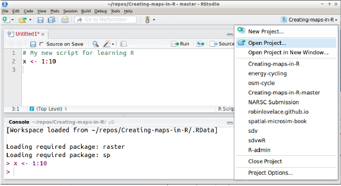
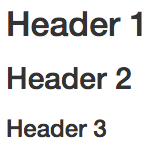
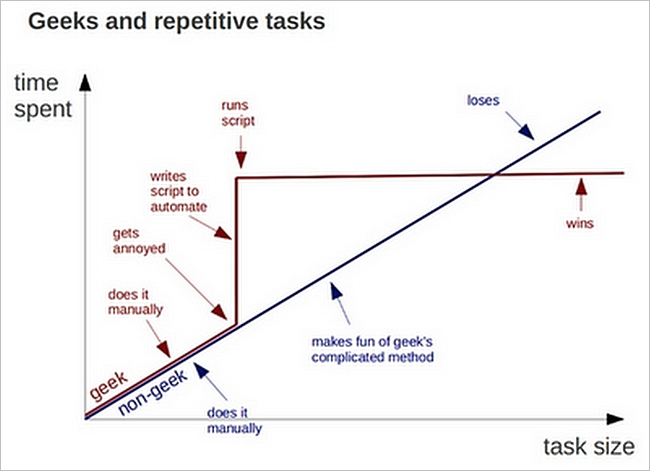
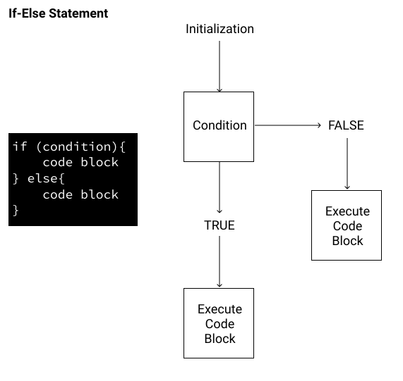
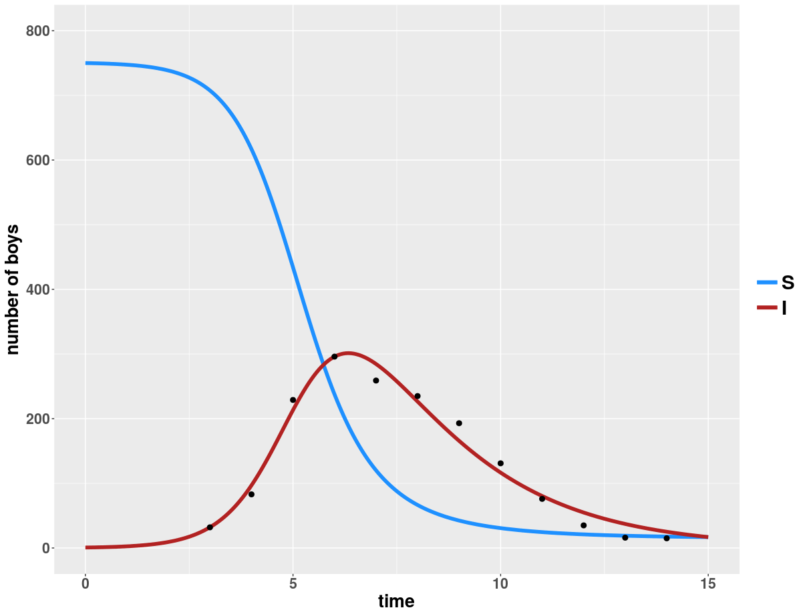
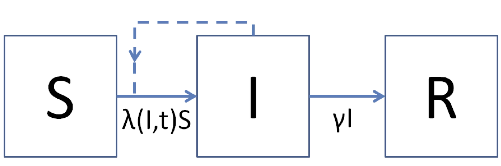
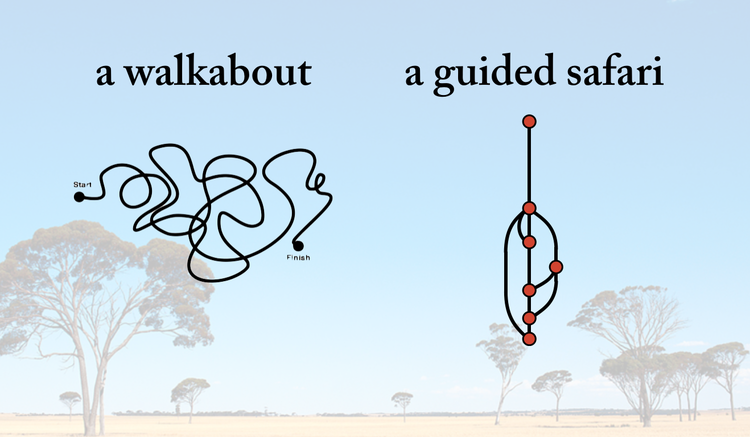
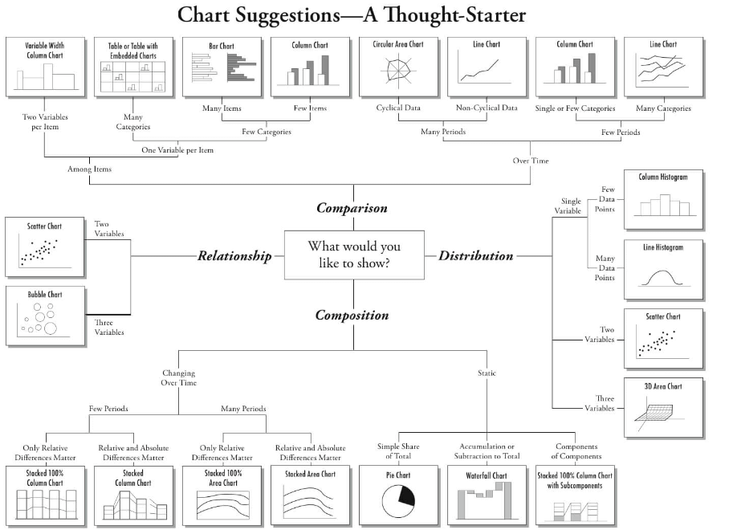
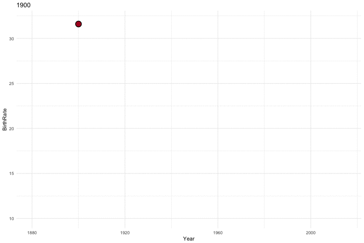

```{r setup, include=FALSE}
knitr::opts_chunk$set(echo = TRUE)
```

# Introduction to the series

This is the first of four sessions on using `R` and R Studio as part of your research process. These workshops were designed for you to develop a foundational understanding of `R` programming. This will not be an exhaustive course, but instead focuses on giving you the skills needed to learn the skills your particular project requires. The exercises used throughout the series were chosen because they mirror tasks a typical REU student might need to complete. 

Each workshop has a short reading that introduces important concepts that we will apply during the workshops. Examples of `R` code use the `Courier New` font with grey highlight. 

The first two workshops focus on covering the basics of `R` and R Studio for scientific research. The third workshop focuses on infectious disease modeling which is a key tool used in the field. Finally, the last workshop covers data visualization and developing a outline for your project. This last workshop will be a useful reference when creating the [scientific posters](http://reu.ecology.uga.edu/?cat=34) you'll be presenting at the end of the REU program, along with the `R` project that we ask you to submit at the end of the program. Each workshop is led by a different instructor and are happy to help with follow up questions. 

To get the most out of this experience, I suggest:

* Complete the reading *prior* to attending the workshops. 
* When you get stuck:
    + Google your problem. Chances are someone else has hit the same roadblock.
    + Ask your peers for help.
    + Ask the instructors for help. 
* If you understand a concept, test yourself by trying to teach it to a peer. 
* Look for ways to apply these tools to your research. 

As I've already mentioned, the exercises focus on authentic tasks. This approach prioritizes task completion over detailed technical knowledge of programming in `R`. If you're working on a quantitative project or are just curious, I suggest [R for Data Science](http://r4ds.had.co.nz/) or the [Introduction to R free course from DataCamp](https://www.datacamp.com/courses/free-introduction-to-r) for more indepth understanding of `R`. We have also setup 6 months free access to the paid DataCamp `R` course. We will recieve a seperate email with details.  


# Workshop 1: Introduction to R 

The topics covered in this workshop's reading include:

  1. What is `R` and RStudio? 
  2. Introduction to data with tidyverse
  3. Troubleshooting 
  4. Exploring data with descriptive and inferential statistics 
  

## 1. What is R and RStudio

`R` is a statistical programming language and environment commonly used in many scientific fields. The open-source software is maintained by [CRAN](https://cran.r-project.org/) with contributors from all over the world. Since `R` is open-source, the software is freely available and has constantly expanding capabilities. We will use `R` mainly for data manipulation and statistical inference.   


### Why use `R`? 

**1. R is flexible **

I've already mentioned that `R` is free, but that isn't the only implication of open-source software. This also means that it can be modified by any user. Scientists can develop new analytical methods, and share with the broader scientific community. The sharing of methods is often done by publishing a package to CRAN containing the needed code for the analysis. which reduces the amount of effort a scientist needs to invest to explore new approachs! You'll learn more about packages a bit later.  

**2. R is powerful **

This programming language can handle complex and large data. Later in the workshop series, we will simulate a disease outbreak. `R` will allow us to quickly program increasingly complex simulations. Finally, for really *big* simulations or problems, `R` supports multicore task distribution. This allows computers to work together shortening computing time. 

**3. R is reproducible**

Reproducible in this sense means there is written documentation - the code- of any data manipulation, intermediate calculations, and the final analysis. This written documentation makes it easy to clearly share methods between scientists, including your future self.  

**4. R has a supportive community **

CRAN and the `R` community are very helpful when trying to solve problems. Any package published in CRAN has a manual. These explain the detailed workings of the package. Additionally, most packages have [vignettes or tutorials](http://lajeunesse.myweb.usf.edu/metagear/metagear_basic_vignette.html) that are linked in the manual or found with a quick google search of the package name. In addition to these resources that come with packages, there are many forums to ask specific questions. [StackOverflow](https://stackoverflow.com/questions/tagged/r) and [Rbloggers](https://www.r-bloggers.com/) are two popular forums. Twitter is also a great resource. If you're interested in developing your data manipulation and visualization skill check out #TidyTuesday run by [@ thomas_mock](https://twitter.com/thomas_mock?lang=en) . 

**5. R can be run through RStudio**

R Studio is a user friendly `R` working environment that makes it easy to organize projects and provides several improvements over the default `R` working environment such as providing an integrated full featured script editor and remembering all graphics outputs for a session. It is available for most operating systems (windows, mac, and linux), and can be downloaded here: http://www.rstudio.com/

R Studio has four display windows each with their own functions. 

### The four windows

Editor (upper left): this window only appears when you have an open file. This window contains the RStudio script editor. It colors different types of code differently. For example, functions and named objects are colored black, numbers are colored blue, and operators are colored gray. It allows you to execute lines of a script individually or in bulk by selecting the lines of code you wish to execute and hitting the "Run" button near the upper right hand corner of the window, or by hitting "ctrl+enter". Note that when your run any code, it is sent to the R console window to be executed.

Console (lower left): this is the command line prompt within `R`. Code can be sent here from the scripting window, or typed or pasted here directly.

Output and miscellaneous window (lower right): this window has several tabs. Files shows all of the files in the directory you are currently working from. Plots shows the output of all R graphics commands that have been executed during a session. Packages shows what libraries are available and which are currently loaded. Help shows help files that have been queried.

The workspace/ history window (upper right): This window has two tabs. Workspace shows you all of the objects currently in memory. History shows you all of the commands that have been executed during a session. Note that the Workspace tab can be used to import data using the Import Dataset button, but this is generally better done manually using commands such as `read_csv()` in the script window or the R console.


### Packages

`R` "packages" are libraries of code, specialized collections of functions (and often data), most of which are not part of the core `R` package. Many of them implement specialized statistical or numerical methods that would not be covered in typical courses. For example, deSolve is a package that allows users to numerically solve differential equation models. Differential equation models are often used to represent the dynamics of epidemics, so tools for solving them can be very useful to scientists studying infectious diseases. Packages that are loaded into or are currently active in R are referred to as "attached". In RStudio, new packages can be downloaded and installed by clicking on the "Tools" tab and selecting install packages.

### R Markdown (.Rmd)

RStudio has developed different file types that allow the user to mix different types of programming and natural language together. The most common file type used is `.Rmd`, which stands for R markdown. This file type can accept `R` code, html markdown, and latex to produce html, pdf, word, and presentation files. The exercises, readings and slides were all made using `.Rmd` files. The final document is produced by compiling or knitting the `.Rmd`. 

If you have never used a markdown language before check out the [R Markdown cheat sheet](https://www.rstudio.com/wp-content/uploads/2015/02/rmarkdown-cheatsheet.pdf) for tips on setting heading, italics, bold, etc. 

Most of the `R` code in a `.Rmd` needs to be within a code chunk which starts with three back ticks followed by a lower case r within curly brackets (```{r}). The code chunk ends with three back ticks. There are other options that can be included in the curly bracket following the lower case r (See the [cheat sheet](https://www.rstudio.com/wp-content/uploads/2015/02/rmarkdown-cheatsheet.pdf)). 

The basic `R` code chunk can be created by using *Cmd+Alt+i* or *Ctrl+Alt+i* on Windows.

You can execute chunks by clicking the *Run* button within the chunk or by placing your cursor inside it and pressing *Cmd+Shift+Enter* or *Ctrl+Shift+Enter* on Windows. 


## 2. Introduction to tidyverse

This first workshop jumps starts your `R` data manipulation and exploration skills with a code-along using `tidyverse`.

The tidyverse is a set of packages that work in harmony because they share common data representations and API design. The `tidyverse` package is designed to make it easy to install and load core packages from the tidyverse in a single command.

The core tidyverse includes packages that you're likely to use in everyday data analyses, such as [ggplot2](http://ggplot2.tidyverse.org/) for data visualization and [dplyr](http://dplyr.tidyverse.org/) for data wrangling. You'll focus on these two during a code-along. 

Code using tidyverse syntax starts with `data` and is followed by one or more `verbs` to be done to the data. The data and verbs are linked together using `%>%` which is called a pipe. You can type out the pipe operator or using the shortcut *Cmd+Shift+M*. The `tidyverse` syntax is an alternative to standard `R` (commonly called 'base `R`'). We are starting with `tidyverse` because it is easier for novice programmers to understand. As your `R` programming skills develop you might find yourself switching between base `R` and `tidyverse`.  

Here is a quick overview of [differences between base R and tidyverse](http://www.science.smith.edu/~amcnamara/blog/teaching/2018/02/11/Syntax-comparison.html?utm_content=bufferc6c7a&utm_medium=social&utm_source=twitter.com&utm_campaign=buffer) `R`.


## 3. How to get unstuck

A major part of *learning to learn* is developing troubleshooting skills. Each package has a long-form description called a [vignette](https://cran.r-project.org/web/packages/rmarkdown/rmarkdown.pdf). Individual manual pages for functions can be pulled up within R Studio by preceding a function with '?' in the console. A double question mark searches function help pages. 

Manual pages follow a set format.

 


<br>

In addition to vignettes and manual pages, package authors will often make guides or examples that are returned by a Google search. Once you have a  handle on a function or package, [cheat sheets](https://www.rstudio.com/resources/cheatsheets/) are a useful reference. R Studio has a few, along with a bank of user contributed cheat sheets. You'll often find these cheat sheets posted near computers in labs. 

### Error warnings

Error warnings are part of the coding process. Errors can be the result of a minor typo or a larger issue with the code. The first step of dealing with an error is trying to understand the error message returned. Since `R` packages are user contributed, the helpfulness of an error message differs from function to function. If you're struggling to understand an error message, Google is your friend. Goggling the error message normally returns a useful response on Stack Overflow, a blog post, etc. It is very unlikely that you're the first person to come across the error. 

R Studio has a more detailed [help guide](https://www.r-project.org/help.html). 


## 4. Exploring data


### Descriptive Statistics 

When exploring a new dataset, especially in the workshops, one of the first steps is calculating [descriptive statistics](https://en.wikipedia.org/wiki/Descriptive_statistics). Calculating the mean, standard deviation, and quantiles can be quickly completed using base `R` functions (ie.`mean()`, `sd()`, `summary()`). What other information might you want to know when exploring new data?

<iframe width="560" height="315" src="https://www.youtube.com/embed/MRqtXL2WX2M" frameborder="0" allow="accelerometer; autoplay; encrypted-media; gyroscope; picture-in-picture" allowfullscreen></iframe>

### Inferential Statistics 

 Inferential statistics is concerned with the evidence for or against certain ideas, and is the branch of statistics that deals with hypothesis tests. If you have taken courses in probability and statistics, you may recall concepts such as p-values, F statistics, z-scores, and confidence intervals. The workshop series will cover t-tests, correlations, and linear regressions a subset of inferential statistics. Below is a conceptual review of these methods that we will be using during the workshop series. 

First, let's simulate some data to explore. Data is often organized into a matrix or grid, where the columns are the different variables, and each row is an observation. I will create 6 variables (columns) labeled x1 through x6 with 50 observations (rows). The summary of the data is below. 

```{r simulated data, echo=FALSE, warning=FALSE, message=FALSE}
require(mvtnorm) # require is an alternative to `library()` that is best used inside of functions. 
sigma1 <- matrix(c(1, 0, 0, 1), nrow=2, byrow=TRUE)
sigma2 <- matrix(c(1, 0.5, 0.5, 1), nrow=2, byrow=TRUE)
sigma3 <- matrix(c(1, 0.9, 0.9, 1), nrow=2, byrow=TRUE)

set.seed(10281979)
x1 <- rmvnorm(50, mean=c(0,0), sigma=sigma1)
x2 <- rmvnorm(50, mean=c(0,0), sigma=sigma2)
x3 <- rmvnorm(50, mean=c(0,0), sigma=sigma3)

d <- as.data.frame(cbind(x1,x2,x3))
colnames(d) <- c("x1","x2","x3","x4","x5","x6")

summary(d)
```

#### t-test

To start, we’ll consider the problem of testing for a difference of means. The problem is this: suppose we have two different sets of observations and we would like to know if these sets are different from each other, or if the numerical differences we see are simply based on sampling error. Suppose we collected 25 observations from two locations. We might want to know if x1 in the two locations are different.  

```{r ttest plot, echo=FALSE, warning=FALSE, message=FALSE}
library(tidyverse)

d <- d %>%
  mutate(site = c(rep(1,25),rep(2,25))) %>%
  mutate_at(vars(site), factor)

d %>%
  group_by(site) %>%
  summarise(Mean = mean(x1)) %>%
  ggplot(aes(x = site, y = Mean)) +
  geom_bar(stat = "identity") 

```

 Conventionally, we will say that “no difference” is the null hypothesis and “there is a difference” is the alternate hypothesis. We seek to “reject” the null hypothesis and the traditional statistical test is the t-test. In `R`, a t-test may be performed using the function `t.test()`. The command returns the following:

```{r ttest, echo=FALSE}
t.test(d$x1[which(d$site==1)],d$x1[which(d$site==2)])
```

*Note the t.test requires the measured values from the two populations to be compared (not the mean values)*

As you see, the result consists of a list of different quantities. We will focus on just two. First, the *95\% confidence interval on the difference of means* consists of two numbers -- a lower confidence limit and an upper confidence limit. This interval has the interpretation that were this operation to be repeated multiple times with different data sets, in 95\% of cases the reported interval would contain the true value of the quantity of interest, in this case the difference between the (true, not estimated) mean x1 variables in the two sites. This is a technical definition, which you may be familiar with if you have studied probability and statistics. If you have not studied probability and statistics you can roughly interpret the result this way: any of the values in the interval are broadly consistent with the observed data. 

Inspecting this confidence interval, we see that it is possible that the true average x1 in site 1 exceeded the average x1 in site 2 by as much as 0.80, or as little as -0.23, and everything in between. Since zero is in the interval from -0.23 to 0.80, we fail to reject the null hypothesis that there was no difference in the average values in x1 between the 2 sites.

This conclusion is underscored by the p-value, in this case $p=0.2739$. The p-value can be interpreted this way. Suppose the null hypothesis were true, given the sampling variation inherent in these data, what is the probability that a difference of means this great or greater would be observed? For our example, the probability is $\approx 0.2739$, a 27.39\% chance. One says that a result is *statistically significant* only when the probability of observing such a case by chance is very small, which we name with the Greek letter alpha ($\alpha$) and call the *significance level*. Conventionally, $\alpha$ is chosen to be 5\% or 0.05, so we would say ``this test fails to reject the null hypothesis of no difference at the $\alpha=0.05$ level of significance''.

The video covers the calculations that are needed to derive the confidence interval, and p-value. 

<iframe width="560" height="315" src="https://www.youtube.com/embed/pTmLQvMM-1M" frameborder="0" allow="autoplay; encrypted-media" allowfullscreen></iframe>

<br>
<br>
**Test your understanding:** How should you interpret negative values in the confidence interval? 

<br>

*Answer* <br>
The confidence interval of the difference of means is the estimated difference between the two groups (ie. group 1 - group 2). A positive value indicates the mean of group 1 is larger than group 2. If the difference of means is negative, then the mean of group 2 is larger than the mean on group 1. 

#### Correlations 

Correlation tests are useful for considering the level of association between two variables. From one point of view, correlation is just a descriptive statistic and any two vectors of numbers will have some correlation coefficient. Traditionally, the correlation coefficient is named with the Greek letter $\rho$ (pronounced rho). However, in the traditional hypothesis testing way, we can also express the null hypothesis of no correlation ($H_0: \rho=0$), which we then seek to reject. In `R`, this is done using the function `cor.test()`, which returns a 95\% confidence interval and a p-value, just as `t.test()` did to test for a difference of means.

We have already shown that the mean value of x1 in the two sites do not differ, but are they associated with eachother? The `cor.test()` returns the following:   

```{r corr, echo=FALSE}
cor.test(d$x1[which(d$site==1)],d$x1[which(d$site==2)])
```
<br>
<br>
**Test your understanding:** What is the correlation coefficient ($\rho$) for this data? What conclusion would you make from these results?

<br>
*Answer* <br>
The correlation coefficient is $\approx 0.23$, and the p-value is $0.26$. Using a significance level of $\alpha = 0.05$, we fail to reject the null hypothesis of no correlation. If the p-value was less than 0.05, then we could conclude that the two variables are positively correlated.  
<br>
<br>

Let's explore the correlation coefficient a bit more. The following three plots show three pairs of observations that differ in their degree of correlation. How do the plots change with $\rho$? What would a plot with a negative $\rho$ look like?

```{r, echo=FALSE}
par(mfrow=c(1,3))
plot(x1, main=paste('rho=',round((cor(x1[,1],x1[,2])),2)))
plot(x2, main=paste('rho=',round((cor(x2[,1],x2[,2])),2)))
plot(x3, main=paste('rho=',round((cor(x3[,1],x3[,2])),2)))
```


<iframe width="560" height="315" src="https://www.youtube.com/embed/ugd4k3dC_8Y" frameborder="0" allow="autoplay; encrypted-media" allowfullscreen></iframe>

**Note** The default measure of association returned by `cor.test()` is called *Pearson's correlation coefficient*. However, there are actually several different conceptions of correlation which differ in technical ways. Another of these is called *Spearman's rank-order coefficient* and may be calculated by using the argument `method='spearman'`.

#### <a id="Linear_regression"></a> Linear regression

Linear regression is closely related to Spearman's correlation and also considers the relationship between two variables. Specifically, linear regression assumes that the relationship between two quantities can be represented by a line (which is expressed with the equation $y=mx_i+b$) and that the failure of the data to fall exactly on a line is because of some variation or measurement error in the variable $y$ such that the $i^{th}$ observation $y_i$ can be expressed as $y_i=mx+b+\epsilon_i$, where $\epsilon_i$ is the measurement error. Now, the problem is to find the values of $m$ and $b$ (the slope and intercept) such that the total error is minimized in some sense and possibly also to test hypothesis (for instance that $m=0$ or $b=0$). In ordinary (least squares) regression, we seek to minimize the *sum of squared errors*: $\Sigma_i (y_i-(mx_i+b))^2$. Since this is a *linear model*, the best fitting values of $m$ and $b$, as well as a lot of other information, may be obtained using the function `lm()`.

<iframe width="560" height="315" src="https://www.youtube.com/embed/zPG4NjIkCjc" frameborder="0" allow="accelerometer; autoplay; encrypted-media; gyroscope; picture-in-picture" allowfullscreen></iframe>

We will return to an application of linear regressions later in the series. 

If your research requires more extensive inferential statistics, [Modern Applied Statistics with S by Venables and Ripley](ftp://ftp.math.binghamton.edu/pub/qyu/text.pdf)[^1] is a good resource for some technical background and implementation. 

## Other useful information

You'll notice a stylistic consistency in the exercises. That's because we're adhering to a style guide. In data science *and* programming/coding in general, it's important to get accustomed to using a style guide asap. As Hadley Wickham puts it in the [tidyverse style guide](http://style.tidyverse.org/index.html),

> Good coding style is like correct punctuation: you can manage without it, butitsuremakesthingseasiertoread.

Part I of the [tidyverse style guide](http://style.tidyverse.org/index.html) would be most useful for beginners. It is OK to follow [other style guides](https://google.github.io/styleguide/Rguide.xml), just be consistent.  


# Workshop 2: Reproducible Research with R

The topics covered in this workshop's reading include:

  1. What is reproducible research? 
  2. Applying reproducible research in `R` with RStudio
  3. Automating tasks
  4. Homework for workshop 4
  
## 1. What is reproducible research?

> Reproducible research is the idea that data analyses, and more generally, scientific claims, are published with their data and software code so that others may verify the findings and build upon them. 

<br>


<br>

The push for reproducible research practices arose from the [replication crisis](https://en.wikipedia.org/wiki/Replication_crisis) in science (but see [Fanelli, 2018. PNAS](https://doi.org/10.1073/pnas.1708272114)). The best practices that arose (publishing data, transparent methods, etc.) can also be thought of as a revolution in how we *should* be doing science based on the available technology and the universal need for increased transparency (See [Spellman, 2015. Perspectives on Psychological Science](http://journals.sagepub.com/doi/pdf/10.1177/1745691615609918)). 

The best practices for reproducible research fall into 3 categories: 

1. Reproducible workflow and dataflow practices
    - A reproducible *workflow* consists of data analysis that is a repeatable pattern of computational activities. Why might `R` coding be more repeatable than an analysis done in Excel? 
    - A *dataflow* is reproducible when variable changes (editing or adding raw data) impact downstream analysis. 
2. Literate statistical programming practices
    - *Literate programming* is an approach that natural language **explanations** are interspersed with computer code. *Literate statistical programming* is the mixing of natural language explanations with code that executes statistical analysis.  
3. Content of science archives
    - Publications should be accompanied by data and analysis that adheres to literate statistical programming practices. 

We will address the first two areas in the workshop. The third dictates that truly reproducible research must be archived in a way that allows others to recreate the original findings. Submissions to digital repositories are assigned a unique digital object identifier (DOI) which is referenced in the publication's methods or supplementary information. Commonly used repositories include [Dryad](https://datadryad.org/) and [figshare](https://figshare.com/). 

## 2. Applying reproducible research in `R` with RStudio

Data analysis in `R` makes reproducible workflow and dataflow possible. RStudio has a few additional tools to make reproducible research even easier. 

### Projects
 
 The directory that `R` looks for files referenced in the code is called the [working directory](https://en.wikipedia.org/wiki/Working_directory). You can manually set the working directory using `setwd(PATH/TO/DIRECTORY)` (print the current working directory using `getwd()`). Manually setting an absolute path to a working directory is just fine if that code will only ever exist on that computer in that location. 
 
 Manually setting working directories is the opposite of reproducible research. It also makes collaboration or trouble shooting by others nearly impossible. Absolute paths have even driven the notoriously nice Jenny Bryan ([\@JennyBryan](https://twitter.com/JennyBryan)) to [make statements](https://www.tidyverse.org/articles/2017/12/workflow-vs-script/) like this:
 
 > If the first line of your R script is <br>
 >
 > `setwd("C:\Users\jenny\path\that\only\I\have")` <br>
 >
 > I will come into your office and SET YOUR COMPUTER ON FIRE `r emo::ji('flame')`

Let's avoid any unnecessary computer sacrifices by using [RStudio Projects](https://support.rstudio.com/hc/en-us/articles/200526207-Using-Projects). 

You'll remember, we started the exercise in the first workshop by opening `W1_Excercise.Rproj`. I created this Project when I wrote the exercise. The Project automatically sets the working directory to the location that the `.Rproj` file is saved. It also automatically opens the files I was working on when I closed the Project. So in this case, clicking on `W1_Exercise.Rproj` would launch RStudio and open both `W1_Exercise.Rmd` and `W1_Exercise_soln.Rmd`

When you start a new analysis, start a new Project by:

1. Open RStudio
2. Choose "File" -> "New Project" 
3. From the pop up window click "New Directory", then "Empty Project"
4. Name your new directory. 
5. Use the "browse" button to choose the directory location. 

<iframe width="660" height="415" src="https://www.youtube.com/embed/hKoSJGWnFFA" frameborder="0" allow="autoplay; encrypted-media" allowfullscreen></iframe>

When you're finished working on the project for the day, close the project ("File" -> "Close Project"). When you open the project up again, all the documents you were working on will automatically re-open. 

You can also open and close Projects from a drop down in the upper right hand corner of RStudio. 



**Note:**


The `R project` is designed to integrate with the version control systems Git and Subversion through RStudio ([details](https://support.rstudio.com/hc/en-us/articles/200532077-Version-Control-with-Git-and-SVN)). Ask your lab if this is something you should be using. 


### Revisiting R markdown 

We've already interacted with `.Rmd` files in RStudio. The exercise associated with the first workshop included `R` code chunks. The code was *commented* by lines started with a hash ("#"), while *commentary* or longer explanations where included outside of the code chunk. 

The comments and the commentary should include *why* you're pursuing an analysis or specific approach. It is easy to fall into the habit of commenting *what* the code should do when executed. This pseudocoding approach can be useful while you're writing the analysis, but be sure to periodically edit comments to include explanations. 
  
Incorporating explanations of your analysis through comments and commentary is an essential practice for literate statistical programming. When in doubt include a comment or commentary. At the very least, your future self will appreciate the notes. 


#### Formatting in markdown

Markdown (or sometime referred to as markup) language is short hand for HTML code. RStudio has its own flavor "Rmarkdown" that allows for fast formatting of text. For instance, this document contains section headers, bold and italic text, code snippets, hyperlinks, and other typographic conventions. These are all readily introduced into R Markdown documents using some simple syntax.

The `W1_Exercise.Rmd` illustrated some of these. For example, attaching an URL to some other text  uses a combination of square brackets (for the text) and parentheses (for the URL), *i.e.*, `[This is the URL for R Markdown](http://rmarkdown.rstudio.com)`. The `W1_Exercise.Rmd` also included bold text, indicated by double asterisks around the text to be emphasized, and a code snippet (which isn't evaluated), indicated by single back ticks. Other common formatting is accomplished as follows:

* To italicize text, wrap it in single asterisks.
* Block quotes are indicated by right angle bracket (mathematical notation for "greater than").
* Equations (using \LaTeX markup language) are wrapped in dollar signs, for instance `$\frac{d}{dx}\left( \int_{0}^{x} f(u)\,du\right)=f(x)$` yields $\frac{d}{dx}\left( \int_{0}^{x} f(u)\,du\right)=f(x)$. Latex is a very extensive language for typesetting mathematical equations. It is outside of the scope of this workshop to teach, but if you are familiar with it already you may find it useful to integrate into your markdown documents.
* A new line is generated by a double hard return.

Section titles start on the second new line after some text and are preceded by a hash `#` indicating the section/sub-section level. For example, the code

```
# Header 1
## Header 2
### Header 3
```
produces

 

**Note the hash is interpreted differently inside of code chunks (comment) and outside of code chunks (header)**

Scientific documents often contain additional objects, such as lists, tables, and figures. Lists are easy to produce in R Markdown. Unordered lists (bullet lists) are started on the second line after some text and indicated by single asterisks. Sublists are indicated by indentation with four spaces. Thus,

```
* List item
* List item
    * Sub-list item
    * Sub-list item
```

produces

* List item
* List item
    * Sub-list item
    * Sub-list item

Numbered lists are similarly generated. Unnumbered and numbered lists may even be mixed. Thus,

```
1. List item
2. List item
    1. Sub-list item
    * Sub-list item
```

produces

1. List item
2. List item
    1. Sub-list item
    * Sub-list item


For more information on syntax see [R Markdown document guide](http://rmarkdown.rstudio.com/authoring_basics.html) or the [R Markdown cheat sheet](https://www.rstudio.com/wp-content/uploads/2015/02/rmarkdown-cheatsheet.pdf).

The `.Rmd` can also compile HTML code for more extensive formatting needs (i.e. text color).


The overall look of the document can be set in the header or YAML. Check out the [HTML document guide](https://rmarkdown.rstudio.com/html_document_format.html#code_folding) for more details. The table of contents (TOC) and code folding are extremely useful. 

The YAML for this document is:

```
---
title: "Reproducible research with R"
author: "PopBio REU 2018"
date: "Reni Kaul"
output: 
  html_document:
    toc: true
    toc_float: true
---
```

### Code chunk options

Most of the `R` code in a `.Rmd` is within a code chunk. The basic `R` code chunk can also be created by using *Cmd+Alt+i* or *Ctrl+Alt+i* on Windows shortcuts.


A code chunk is indicated by starting on a new line (usually with a hard return in between for clarity) with three back ticks. Typically, we will also want to specify how the code chunk will be evaluated (*i.e.*, we may pass in some *options*), in which case the back ticks are followed by a small number of commands in curly braces. The first of these is the letter "r", followed by a space, then a name for the code chunk (`{r Unique Name, OPTIONS}`). Note, that the first comma comes after the code chunk name. 

These options can be set for all code chunks in the document by including `knitr::opts_chunk$set(echo=FALSE)` in the first code chunk of the document. These global options are overridden by conflicting options set in a code chunk. 

Some useful options are:

* `eval` (whether or not to evaluate the code chunk)
* `cache` (whether to cache the results of the code chunk, for instance if the compute time is large)
* `echo` (whether or not to include the source code in your compiled document)
* `tidy` (whether or not the R code should be automatically tidied for presentation)
* `fig.keep` (whether or not to also save figures in their own file)
* `fig.path` (where to store figures)

All of the different chunk options can be found at [https://yihui.name/knitr/options/](https://yihui.name/knitr/options/). 

### In-line `R` Code

In some cases, it is useful to execute `R` code in-line with natural language. In-line code is designated by a single back tick followed by "r" and code you'd like executed. The in-line code is ended with another back tick.

Let's say I've calculate the mean age of survivors on the Titanic. I'd like to include this value in-line with some other commentary. 

```{r, eval=TRUE, echo=TRUE, warning=FALSE, message=FALSE, tidy=TRUE}
library(tidyverse)

passengers <-  read_csv("data/train.csv")

survived_Age <- passengers %>% 
                drop_na() %>% 
                filter(Survived == 1) %>% 
                summarize(mean(Age))

rtext <- "r round(survived_Age, digits = 1)"
```


I could include the value in my commentary by typing:

> The mean age of passangers that survived  is \``r rtext`\`.

-OR-

> The mean age of passangers that survived  is 32.9.

both render to:

> The mean age of passangers that survived  is `r round(survived_Age, digits=1)`.


**<i>How does in-line code relate to a reproducible workflow?</i>** 

### Postscript on best practices

One approach is to adopt the practice to *never change the raw data*. That is, once collected, cleaned, and organized, the raw data table for an analysis may be archived and the archived version considered to be fixed. But, what if an error is discovered? Or, more commonly, what if analysis requires some subset of the data or transformation of the data? The practice of literate statistical programming allows these operations to be included in the algorithm. That is, they are considered to be part of the work flow. If a data point needs to be changed, this can be done programmatically, in a *pre-processing* step that precedes the actual data analysis. Besides ensuring the stability of the underlying information, this approach also enables documentation of the rationale for any such changes to the data.

Your project might include multiple data sets, and analyses. For this reason, it is important to keep your project directory organized. I suggest you use the following organization. 


 **data/** :  holds all raw data that is needed for the analysis

 **data_output/** : place to save the intermediate, and completed analysis files
 
 **documents/** : holds any relevant documents including metadata, manuals, or publications. If you have multiple `.rmd` files you can save them here, otherwise I would save it to the working_dir/

 **fig_output/** : place to save figures that are produced as part of data exploration or explanation 

 **scripts/** : place to save custom functions

## 3. Automating repetitive tasks 

Workflows often require repeating the same task many times. Fortunately, `R` has a few different ways to handle recursive tasks. The automation that you use depends on the number of times you plan on repeating the task, the size of the tasks, and the intended use of the output. The following methods can be used individually, or in combination to create the solution appropriate for your needs. 



### Control Structures

Control structures allow you to control if, when, or how often code is executed. These can be thought of as logic statements. This is a way to make your code more flexible to the type of input, and output you'd like. Some common control structures are:

* `if` and `else`: testing a condition and acting on it

* `for`: execute a loop a fixed number of times

* `while`: execute a loop while a condition is true

* `repeat`: execute an infinite loop (must `break` out of it to stop)

* `break`: break the execution of a loop

* `next`: skip an interation of a loop



These control sturctures are much more common when using base `R` rather than `tidyverse`, but you may come across a problem that can be solved with the above statements. We will come back to `for` statements in workshop 3. 

### Apply Family Functions

Apply functions are used to do bulk calculations. Suppose we would like to determine the mean, min, and max. value of every column in a large data set. We could do this one by one using a control structure for each calculation, or all at once using an apply statement. In fact, much of the `tidyverse` is based on using the apply function approach. We won't explicitly cover apply functions in the workshop, but you might come across a need for them in the future. This is especially true if you are working in base `R`. 


<iframe width="560" height="315" src="https://www.youtube.com/embed/f0U74ZvLfQo" frameborder="0" allow="accelerometer; autoplay; encrypted-media; gyroscope; picture-in-picture" allowfullscreen></iframe>


If you'd like a more indepth explaination of control structures vs apply statements check out this [tutorial](https://nicercode.github.io/guides/repeating-things/). 

### Functions

You've already taken advantage of functions that are part of the `tidyverse` package. However, `R` also allows the user to create their own functions. The video below introduces the basic structure of a function, along with the flexiblity of the outputs. Don't worry if the different output options are unfamiliar. I just want you to have an idea of the different possibilities. You will have a chance to practice writing functions in this workshop. 

<iframe width="560" height="315" src="https://www.youtube.com/embed/i2VH5jIL76Y" frameborder="0" allow="accelerometer; autoplay; encrypted-media; gyroscope; picture-in-picture" allowfullscreen></iframe>

<!-- Data camp functions 
<iframe width="560" height="315" src="https://www.youtube.com/embed/M4fMccWy5lU" frameborder="0" allow="accelerometer; autoplay; encrypted-media; gyroscope; picture-in-picture" allowfullscreen></iframe> -->

## 4. Homework for workshop 4

The REU program ends with a poster session where you present the work you've completed this summer. To help you reach this point, and help us understand how you're using `R` we would also like you to submit an `R` project containing any relevant data and a .Rmd file that follows the reproducible research practices outlined above. We will spend a part of the 4th workshop developing an outline based on a [template](https://github.com/renikaul/R_workshopsREU/blob/master/RMD/Template.Rmd) for you to fill in as your work progresses. To make the most out of that time, and to help you prep for the first breakout session (more info coming via email) we've created a worksheet to guide your thought process. If you're struggling to answer the questions, make sure to chat with your mentors! Please bring the completed [worksheet](https://docs.google.com/document/d/1ENacpY9VF7qzh-4OMCeKGMfdZ_aq_nL_mRW9yWoAS5c/edit?usp=sharing) to workshop 4.

---

# Workshop 3: Simulating infectious diseases with R

The first two workshops focused on developing `R` programming skills. The third workshop is slightly different in that it focuses on a single task. This workshop will cover simulating infectious diseases. Before covering the programming aspect, we need to cover the conceptual details of population models.    

The topics covered in this workshop's reading include:

  1. Concept of mathematical models
  2. Example mathematical model: population growth
  3. SIR model
  4. Example application of SIR model
  5. Other infectious disease models
  6. Automating data analysis with loops 
  
*Note on syntax* 

 The first two workshops were using `tidyverse` where data is linked to verb(s) using a pipe (`%>%`). This workshop will start to introduce more base `R` syntax. This was a purposeful choice since many of the tutorials, and guidance that you'll come across for mathematical models will be in base `R`. If you're in a quantitative lab, you may have also noticed that many people code in a blend of the two styles. It is understandable to get confused, or stuck when switching between the two syntaxes. It is especially important to practice your problem solving skills, which includes asking for help, in this workshop.  
  
## Introduction to infectious disease modeling

Infectious diseases cause a substantial global burden of morbidity and mortality. Understanding infectious diseases involves multiple facets including medicine, microbiology, genomics, immunology and vaccine and drug development. However, none of these approaches address important questions at the population level.



The figure above shows the number of children confined to bed (I: infected) as a result of contracting influenza in a boarding school. As the number of infected children increase, the number of healthy children (S: Susceptible) decreases. 

Modeling can help us answer the following basic questions arising from the epidemic:

- How many children will become infected through the course of the epidemic?  
- How long will the epidemic last? 
- When will the number of cases start decreasing?
- Why are the number of cases decreasing?
- What lead to an epidemic? 

If we are able to predict the epidemic curve with a model, we can also evaluate the effects of different control measures. We can answer questions such as, is it better to randomly vaccinate children in the school, or target a particular age group?

## 1. What is a mathematical model?

We distinguish between mathematical and statistical models.  *Mathematical* or *dynamical* models are abstract models that uses mathematical language to describe the behavior of a system. The epidemiological processes (e.g., infection of susceptible individuals, recovery of infected individuals) are represented by equations. *Statistical* models attempt to describe relationships between observed quantities and independent variables. Otto and Day [^2] give a nice overview of the differences between these two approaches. Models can help us to understand nature and to make predictions. In this workshop, we will show you how to formulate a basic mathematical model of an epidemic and how to solve this model in R.

Why use mathematical models? A mathematical model can give us key insights into how various forces act to change a system over time. For example,the number of susceptible, infectious, and recovered hosts change through time based on the number of hosts for a parasite, birth of susceptibles into the population, transmission of the infection, and recovery from infection.

A model allows us to keep track of quantities that change over time (*state variables*). The *dynamics* of a system is the pattern of changes that occur over time. In reality, models are a convenient way to simplify the world. 

There are innumerable things to keep in mind when thinking about models. Some are, in no specific order:  

- All models are wrong, but some are useful (attributed to George Box)  
- There is no 'perfect' model
- There are often trade-offs between model realism and generality
- Models should have a purpose - you should always be able to say *why* a particular model was created, or what question it answers, or what insight it generates about the real-world

### Model types
<a id=recursive_eq></a>
Mathematical models can be deterministic or stochastic. A *deterministic model* assumes that the future is entirely predicted by the model. A *stochastic model* assumes that random events affect the system, in which case the model can only predict the probability of various outcomes in the future.

A key decision when developing a methematical model is how to treat time.

*Discrete time models* track changes to variables in discrete time steps.
*Continuous time models* allow variables to change at any point in time (i.e., time is represented by a continuous axis).

Which type of model to use depends on the biological question. Continuous variables are often used if the variables take on large enough values that treating them as continuous introduces very little error to the results. Another justification for their use is that it is typically easier mathematically to treat variables as continuous -- calculus can be used to analyse the model.

Typically, discrete time models are written as *recursion equations* that describe the value of variables at the next time step in terms of a function of it at the current time step, e.g.,
$$\begin{aligned}
N_{t+1} = \text{``some function of }N_t\text{"},
\end{aligned}$$
where $N_t$ is the value of the (discrete) variable (e.g., population size) at the current time $t$. 

Continuous time models are often written as *differential equations* that describe the *rate* at which variables changes over time. Many of the core theories of epidemic propagation are expressed as a *system* of differential equations known as a *compartmental model*. Suppose that $N(t)$ is the value of a (continuous) variable at time $t$. Then we may express its rate of change over time as a differential equation:

$$\begin{aligned}
\dfrac{dN}{dt} = \text{``some function of }N(t)\text{"}, (1)
\end{aligned}$$

Often, the right hand side of the differential equation takes the form
$$\begin{aligned}
 \text{some function of }N(t)\text=\text{rate of increase of } N(t)-\text{rate of decrease of }N(t). 
\end{aligned}$$

This side of the equation describes how the various biological forces change the value of the variable $N(t)$. All sources of change in $N(t)$ are included.

Here time $t$ is the *independent variable* and population size is the *dependent variable*. If we plot $N(t)$ as a function of time, then the slope of the curve would be $dN(t)/dt$. If the *state variable* is increasing over time, the slope is positive; if it is decreasing, then it is negative. 

We can use this equation to infer the value of $N(t)$, i.e., to obtain a *solution* of the differential equation. A solution is a function that satisfies the differential equation. If we can find this function, then we have *solved* the differential equation. Solving a differential equation allows us to deduce *long-term behavior* -- to answer ``what will happen in the future?".

## 2. Example mathematical model: population growth
 
In many biological systems, differential equations arise because the rates of change of a process of interest themselves change as the system does. A simple differential equation that describes, for example, the rate of change of the size of a population of *E. coli* bacteria, is
$$\begin{equation*}
\dfrac{dN}{dt} =r N. (2)
\end{equation*}$$

Here $r$ is the instantaneous per-capita growth rate. Equation 2 is an example of an *ordinary differential equation* because it has a single independent variable (here, it is time $t$).


We would like to know the solution of equation 2, or the value of the dependent variable $N(t)$ at time $t$. How can we obtain this from equation 2?

Typically when we talk about solving ordinary differential equations we mean solving an *initial value problem*: We want to start with a condition of the state variables (the *initial condition* -- the value of bacterial population at time $t=0$) and inquire about the future values of the state variables as the system evolves over time.

This requires performing an integration. For example, we can solve for $N(t)$ in equation (2) by taking the integral of both sides with respect to $t$, i.e.,

$$\begin{equation*}
\int \dfrac{dN}{dt} dt = \int r N(t) dt \\ 
\frac{1}{N(t)} dN = r dt \\
\vdots \\
N_t = N_o e^{rt}
\end{equation*}$$

**Fill in the steps to solve this differential equation ([hint](https://www.mathsisfun.com/calculus/separation-variables.html)).** 

Sometimes (as is the case for equation (2)), the integration can be done by hand. Often it is very difficult or even impossible to obtain an analytical solution to a differential equation. But this is not a problem -- we can use the computer to calculate the right hand side numerically. 

In general, this can be a tricky business. Fortunately, this is a well studied problem in numerical analysis and (when the equations are smooth, well-behaved functions of a relatively small number of variables) standard numerical integration schemes are available to approximate the integral with arbitrary precision.  Particularly, `R` has a very sophisticated ordinary differential equation solver, which (for many problems) will give highly accurate solutions.

To solve an ordinary differential equation (ODE), the basic numerical approach used by ODE solvers is to consider the change in each variable during a very small time interval $\Delta t$ (i.e., approximate the derivative by a discrete time difference equation) ,

$$\begin{equation*}
\dfrac{dN}{dt} \approx \frac{N(t+\Delta t) - N(t)}{\Delta t}.
\end{equation*}$$
Rearrange this equation to obtain
$$\begin{equation*}
 N(t+\Delta t)= N(t)+\dfrac{dN}{dt}{\Delta t} 
\end{equation*}$$

and then iterate to get a numerical solution for $N(t)$. This is Euler's method, but it is not efficient because very small time intervals are necessary to obtain accurate predictions when $N(t)$ is changing rapidly. Numerical algorithms, such as the $4^{th}$ order Runge-Kutta algorithm (implemented in R), take advantage of [Euler's approximation](https://youtu.be/q87L9R9v274) to obtain an approximate solution by solving a sequence of linear approximations at smaller and smaller step sizes until a specified tolerance is achieved. The LSODA adaptive step size solver in R is a powerful algorithm because it can automatically adjust its step size according to how rapidly the solution is changing.

## 3. The SIR model

The population model above can be expanded to describe how an infectious disease spreads in a population. The classical $SIR$ compartmental model tracks the proportions [^3] of the population in each of three classes (or compartments): susceptible, denoted by $S(t)$, infectious ($I(t)$) and recovered ($R(t)$). As the epidemic progresses, these quantities can change over time. 


In a *demographically closed* system, flow out of one class must enter another class, giving rise to a *conservation property*: the population size does not change over time. Thus no births, deaths or migration events occur. Hence, the proportions of each class sum to one, i.e., $S+I+R =1$. The key assumptions of the most basic SIR model are:

- Susceptibles become infectious at a rate $\lambda (I,t)$ per susceptible individual per unit time, leading to a total flow $\lambda (I,t) S$ from the susceptible to the $I$ class. The function $\lambda(I,t)$ is called the *force of infection*. It is the per-capita rate at which susceptibles contract the infection.  
- Infectious individuals recover at a rate $\gamma$ per infectious individual per unit time, leading to a total flow rate of $\gamma I$ from the infected to the recovered class.  


To clarify and organize the processes in a $SIR$ model (or the processes of any model), it is useful to draw a flow diagram. A flow diagram illustrates how each variable affects its own dynamics and those of the other variables.



Here, the boxes represent the $S$, $I$ and $R$ classes. Arrows that start at one box and go to another box indicate conversion of members of one class to another class. Solid arrows between boxes indicate the process removes an amount of the variable (the arrow leaves the box) or contributes some amount to a variable (enters the box). If an arrow exits and returns to the same box, then that variable can regenerate itself. Dashed arrows indicate there is an interaction between the variables, i.e., when a variable influences the flow into another box but does not represent a decline in the variable from which the arrow begins (e.g., an infectious individual does not lose the infection when she passes it on to someone else). *What does the dashed arrow represent?*

From the flow diagram, we can write down how the state variables $S$, $I$ and $R$ change according to the following system of differential equations:

$$\begin{aligned}\label{eqn:SIR}
\frac{dS}{dt} &= -\lambda(I,t)\,S \notag\\
    \frac{dI}{dt} &= \lambda(I,t)\,S-\gamma\,I\\
    \frac{dR}{dt} &= \gamma\,I.\notag
\end{aligned}$$

These equations have the initial conditions $S(0) > 0$, $I(0) > 0$ and $R(0) \geq 0$. For the force of infection $\lambda(I,t)$ we'll assume that it has the form

$$
\lambda(I,t) = \beta I
$$
so that the risk of infection a susceptible faces is proportional to the fraction of the population that is infectious. The parameter $\beta$ is the contact rate per susceptible and is a constant for each individual in the system. Notice that by writing the force of infection as $\lambda(I,t)$ we allow for the possibility of a contact rate that varies with time t. *Can you think of a situation where contact rate would change over time?*

Note this model is not suitable for all infectious disease scenarios. The model is suitable for the spread of an infection in a large naive population where the initial infectious agent (ie. number of infected individuals) is small and the resulting epidemic occurs sufficiently quickly that demographic processes (ie. births and deaths) are not important. 

## 4. Example applications

### Will the pathogen invade the population? (R nought)

This reading started with an example of an influenza outbreak and a possible list of questions models can help answer. When assessing a pathogen, often the first question asked is *will there be an outbreak?*. 

The plausibility of an outbreak or a pathogen's ability to invade a new host population can be assessed by measuring the number of *new* infections that arise from a single infected host. This value $R_0$ is called the *basic reproduction ratio* (or $R_0$, see Anderson and May [^4] for more information) and is compared against the threshold for pathogens to invade a population. 

**What might be a 'threshold' value of $R_0$?**  

<iframe width="560" height="315" src="https://www.youtube.com/embed/jKUGZvW99os?rel=0" frameborder="0" allow="autoplay; encrypted-media" allowfullscreen></iframe>

### Deriving R nought from time series data

The video explained how to calculate $R_0$ by tracking the number of new cases caused by a current case. This type of data is produced through a method called [contact tracing](https://en.wikipedia.org/wiki/Contact_tracing) which is time intensive and can be difficult to collect. So how could we calculate the $R_0$ for the flu data presented at the beginning of the reading?   

It can be shown (using arguments not reproduced here) that for a rapidly spreading epidemic

\begin{equation*}
  \log{I_t}\;\approx\;\log{I_0}+(R_0-1)\,(\gamma)\,t, 
\end{equation*}

where $I_t$ is the number of individuals currently infected at time $t$ and $\gamma^{-1}$ is the *infectious period*. This implies that a semi-log plot of $I_t$ vs $t$ should be approximately linear with a slope proportional to $R_0-1$ and the recovery rate. If we plot the influenza data, we see that this is indeed the case for the first 5 days.


```{r flu data plot}
flu <- read.csv("data/flu.csv") # load data that is two columns named day, and flu

plot(flu, type = 'b', log = 'y', xlab = 'Day', ylab = 'Number of individuals infected') # example plot using base R syntax
```

Ultimately, then, [linear regression](#Linear_regression) will allow us to estimate $R_0$. However, to do this we need to note a few things. First, it is the logarithm of the number of cases on day $t$ that takes the place of $y$ in our expression $y=mx+b$. In `R` the logarithm is calculated using the function `log`. 

Next, $log(I_0)$ takes the place of $b$. If we assume that the epidemic was started by a single infectious individual, then $b=log(1)=0$, so we're interested not in any best fitting line, but only that best fit line that also goes through $(x=0, y=0)$. In regression analysis, this is called fitting a model *without an intercept*. 

Third, if we interpret $t$ as the quantity that take the place of $x$ in $y=mx+b$, then we see that it is the entire expression $(R_0-1)\,(\gamma)$ that forms the slope $m$. Finally, the formula only applies to the *epidemic takeoff*, so we only want to fit a subset of our data. Inspecting the plot suggests that we might fit our line to data for all days up to and including day 5 of the outbreak. Now, we fit the line using `lm()` as follows:

```{r}
model <- lm(formula = log(flu) ~ day - 1 ,data = subset(flu, day <= 5))

```


Before looking at the output, there are a number of things to notice about this command. 

First, the results are stored in an object that I have called `model`. 

Second, the first argument (called `formula`) is nothing like any argument we've seen before. It looks sort of like a mathematical expression. The first term says that the quantity which we want to take the place of $y$ in our formula $y=mx+b$ is the logarithm of something called `flu`. (But where does `flu` come from? More on that in a moment.) 

Next we see the character tilde ($\sim$). This may be read as "*distributed as*" or you may more simply think of this as taking the place of the equals sign in our formula $y=mx+b$. 

Finally, to the right of tilde we see information about what is on the right hand side of the equation. First, there is `day`, which takes the place of $x$. (But where does `day` come from? Answer: the same place as `flu`.) Because `day` is a variable, `R` assumes you wish to find a slope parameter to multiply by `day`. Finally, we also see that there is a $-1$, which is a coded way of telling `R` that we wish to fit only equations that go through the origin. If we left this off, `R` would seek to find a combination of $m$ *and* $b$ that minimized the sum of squared errors. As it is, `R` will fix the intercept at zero ($b=0$) and return only a slope coefficient. Now, where does `R` look to find the variables `flu` and `day`? This is provided by the argument `data`. The possible values for data are data frames that contain variables called `flu` and `day`. If we supplied the name of a data frame that did not contain these variables `R` would return an error. In our case, however, we're not interested in using all the data in `flu`, but only those records for which `day` is less than or equal to 5, which we obtain using the `subset` function as indicated. This is a base `R` alternative to `filter()`.

Now we wish to see what our fit model consists of. For starters, we can simply type the name of the object at the command line.

```{r}
model
```


This, we see, prints to the screen the formula that was used to fit the model as well as the fit coefficients, in our case $m=1.086$. But, there is more information that we can obtain. Here we come to the other common use of `summary()`. If we ask for a summary of the model, we see that we get a lot more information: 

```{r}
summary(model)
```

the formula; a list of residuals (the $\epsilon_i$ from above); more information about the coefficient $m$, including the estimate, an estimate of its error (i.e. a value that when we add and subtract to the estimate provides an interval -- though not a 95\% confidence interval), something called the ``t-value'' (which we won't worry about more), and finally a p-value for the hypothesis test that the coefficient is equal to zero. Also, we get some additional summary statistics such as the $R^2$ value (fraction of variance explained by the model) and other statistical details.

Now that we've estimated the slope of a linear regression, what is the $R_0$ for flu? We will revisit this in the workshop, so bring your solutions! 

## 5. Other infectious disease compartmental models 

 The $SIR$ model is just one type of compartment model commonly used to study infectious diseases. Compartmental models can be adapted to the specific biology of the study system. For example, in the case where a host never recovers from an infection or infection does not confer immunity it would be appropriate to have just two classes: susceptible and infected. Other pathogens have an extended incubation period between the host being exposed and infectious. In this case, an additional class, *exposed*, might be useful. 
 
In addition to changing the number of classes in a compartmental model, this approach also allows for customization of the parameters controlling the flow into and out of each compartment. How would the $SIR$ model above change if it wasn't demographically closed? 

Common compartmental models:

- $SIS$ : *Susceptible -> Infectious -> Susceptible*.  suitable for representing illnesses that confer no immunity, e.g., influenza, sexually transmitted diseases.
- $SEIR$ : *Susceptible -> Exposed -> Infectious -> Recovered*. suitable for representing illnesses that have long incubation or latency period, e.g., Ebola, tuberculosis.
- $MSIR$ : *Maternally-derived immunity ->Susceptible -> Infectious -> Recovered*. suitable for representing illnesses that have passive immunity at birth from maternal antibodies, e.g., measles.


## 6. Automating data analysis with loops

The last reading introduced automating repetitive tasks using control structures. This workshop will explore [recursive equations](#recursive_eq) with `for` loops. If you recall a `for` loop will execute code a fixed number of times. Let's review our understanding of loops, recursive equations, and then map them onto eachother. 

### loops

Loops or `for` loops repeat a chunk of code a set number of times. This is defined at the beginning of the loop using `for(i in 1:10)`. This can be read as substitute the values 1,2,3,4,...,10 in for the value of `i` in loop code. If I had non-sequential values I wanted to use instead, I would make an object and use `i` as an index for the object. 

```{r}
N.seq <- c(2,4,8,16,32) # set of numbers I'd like to use in my loop

for(i in 1:5){
  print(N.seq[i]) #this will print the i-th number (1-5) of the N.seq object. 
}
```

Now suppose I wanted to calculate the first 5 numbers in a geometrically (doubling) increasing function starting at 2. How would the above loop need to be modified? 

```{r}
N.seq <- c(2,0,0,0,0) # where I would like to save my values, and the starting value of 2. 

for(i in 1:4){
  N.seq[i+1] <- N.seq[i]^2 #this will save the N.seq[i]^2 in the i+1 place. 
}

N.seq
```

Compare the two loops. What's different? How many times is the first loop repeated? the second loop? What objects are being changed during each iteration?

### recursive equations

<a id=recursive_eq></a>
Remember, discrete time models are often written as *recursion equations* that describe the value of variables at the next time step in terms of a function of it at the current time step, e.g.,

$$\begin{aligned}
N_{t+1} = \text{``some function of }N_t\text{"},
\end{aligned}$$

In the case of an exponentially growing populations the discrete time model is written as
$$\begin{aligned}
N_{t+1} = N_t + r*N_t.
\end{aligned}$$

Where the population at the next time step ($t+1$) is the size at the current time ($t$) plus some per capita growth rate ($r$) times the current population size. How should I go about calculating the population size at $t+5$? Since this equation will only tell me what will happen in the next time step, I have to calculate the next time step 5 times, each time updating the value of $N_t$. 

### mapping recursive equations onto loops

We know that `for` loops can be used to execute code many times. In the second `for` loop example, we saw how to use indexing (the square brackets) to calculate the next value based on the current value. The discrete time model of exponential growth has a similar motif where the next value is based on the current value. Try modifying the example to calculate the population size for the next 4 time steps. Assume that the populations started with 10 individuals and has a 20/% growth rate ($N_t=10$, $r=0.2$). Do your values match mine below?

```{r, echo=FALSE}
N.seq <- c(10,0,0,0,0) # where I would like to save my values, and the starting value of 2. 

for(i in 1:4){
  N.seq[i+1] <- N.seq[i]+(0.2*N.seq[i]) #this will save the N.seq[i]^2 in the i+1 place. 
}
```

```{r, echo=FALSE}
N.seq
```

We will revisit this in the workshop, so bring your solutions! 

-----


# Workshop 4: Applying workshops to your work

The goal of the last workshop is to start transitioning to your own analysis. The first half of the workshop will cover data visualizations using both tidyverse's `ggplot()` and base `R` plotting. The second half of the workshop will focus on developing an outline of your `R` project using an [.rmd template](https://github.com/renikaul/R_workshopsREU/blob/master/RMD/Template.Rmd) and the [worksheet](https://docs.google.com/document/d/1ENacpY9VF7qzh-4OMCeKGMfdZ_aq_nL_mRW9yWoAS5c/edit?usp=sharing) assigned in the 2nd workshop. **Please bring the completed worksheet with you.**

The topics covered in this workshop's reading include:

1. Selecting the figure for your purpose
2. Saving high quality figures in `R`
3. Two approaches to the same problem: Base `R` vs `ggplot`
4. Visualizations for data exploration 
5. Mapping spatial data
6. Going further with ggplot
7. Details of R project requirements

## 1. Selecting the figure for your purpose
Plots are used for data exploration and presentation. The visualization types differ in a few ways. 

**1. Audience.** You are the audience for data exploration visualizations. Presentation visualizations are for other scientists not familiar with the work and appear in journal articles, talks, and posters.

**2. Message.** Data exploration is meant to develop insights or find some underlying structure in the data. This is often the first step in an analysis (ie. the GMPD exercise). Data exploration is a wondering and iterative path. Presentation figures illustrate the end finding.

**3. Explanation.** Effective presentation figures need context. Context could include the data source, the pattern observed, how it relates to other data, etc. You are familiar with the data and are highlighting the main points with a visualization. This context can be included by figure annotations or in the case of articles through the caption.  

**4. Complexity.** Presentation visualizations are less complex than exploration figures. Lower complexity could entail only showing a subset of the data, using fewer variables, or presenting the data in the expected method. Colors used in presentation figures should be distinct, color blind friendly, and in the case of articles readable when printed in black and white.  

> Exploration visualizations are part of a discussion, while presentation visualizations should tell a story. 




There are plenty of guides on how to create the "*best*" visualization. This diagram is a good place to start when choosing your data visualizations. 

&nbsp;
&nbsp;



If you're plotting data to for publication, some things you should keep in mind:

  - every addition plot feature is adding additional information
  - color choice (connotation (eg. red is bad, green is good), color blind)
  - how the audience expects to see data

For more details see <i>Ten guidelines for effective data visualization in scientific publications</i> by [Kelleher and Wagener, 2011](https://doi.org/10.1016/j.envsoft.2010.12.006). At some point during your research career, you'll likely hear about [Edward Tufte's](https://www.edwardtufte.com/tufte/) philosophy on maximizing function over aesthetics.

## 2. Saving high quality figures in `R`

At the end of the program, you'll make a [scientific poster](http://hsp.berkeley.edu/sites/default/files/ScientificPosters.pdf) which includes data visualization created in `R`. You can export figures in many different file types (TIFF, PNG, PDF), but what is the best method for poster figures? 

Some recommendations: 

1. The best file format depends on the end use. For printing or electronic display, I generally export as pdf (`pdf()`) or png (`png()`). Journals typically have very specific figure requirements for submission.  
2. Always export with the highest resolution or quality. 
3. Choose the dimensions based on the end use. A figure exported as 2" x 2" will look pixelated and distorted when blown up for a poster. Along similar lines, be mindful of the aspect ratio. Most figures are rectangular, so the original dimensions should also be rectangular. 
4. Double check that all text is readable. You may need to [change the font size or weight](http://www.cookbook-r.com/Graphs/Fonts/).
5. Save figures by R code (ie. `pdf()`). Do not save the figure using the export button above the plot. The general syntax for saving plots is:

```
pdf("File_Name.pdf", dimension and resolution arguements) # the function name is often the file extension
code to make figure plot
dev.off()
```

If you have created a blank or unreadable file, most likely you forgot to end the figure export process by running `dev.off()`.

## 3. Two approaches to the same problem: Base `R` vs `ggplot`

Plotting in base `R` can allow the user to create highly customized plots. This customization takes time, and requires many decisions. An alternative is to use the package `ggplot2` developed by Hadley Wickham based on the [*Grammar of Graphics*](http://www.springer.com/us/book/9780387245447) written by Leland Wilkinson. 

The workshops have exclusively used `ggplot` for visualizations because it works well with `tidyverse` and doesn't require many design decisions up front. All of the figures we have made could have been made in base `R` instead. Given that, in most cases, either works well `R` users tend to have a strong preference for one or the other (ggplot vs. base R puts #TeamEdward vs #TeamJacob to shame). This section will cover some of the basics of base `R`.   

We will walk through an example using base `R` and then recreate the figure using `ggplot2`. For even more side-by-side examples, see Nathan Yau's blog post on [Flowing Data](https://flowingdata.com/2016/03/22/comparing-ggplot2-and-r-base-graphics/). 

### Base `R`

A simple plot can take many more lines of code than you expect based on the visualization. When plotting in base `R` you'll use a handful of parameter settings in either `par()` or in the plotting related functions listed below. 

#### Important parameters
* **pch**: plotting symbol
* **lty**: line type
* **lwd**: line width
* **col**: plotting color
* **las**: orientation of axis labels 
* **bg**: background color
* **mar**: margin size
* **oma**: outer margin size
* **mfrow**: number of plots per row, column. Plots filled in row-wise.
* **mfcol**: number of plots per row, column. Plots filled in column-wise.

#### Important functions
* **plot**: make scatter plot
* **lines**: add lines to plot
* **points**: add points to plot
* **text**: add text
* **title**: add title to axes or plot
* **mtext**: add margin text
* **axis**: add axis tick/labels

Let's create a plot of the total population by county area for 5 Midwest states (example taken from Selva Prabhakaran's [tutorial](http://r-statistics.co/Top50-Ggplot2-Visualizations-MasterList-R-Code.html#Scatterplot_)). This data is part of the `ggplot2` package. We start with the basic scatter plot function `plot()` and then customize from there.  
 
```{r base R, eval=TRUE}
library(ggplot2) #l oad the package with the data
data("midwest", package = "ggplot2") # load the data, midwest is now in the working environment. 
plot(y=log10(midwest$poptotal), x=midwest$area, # call the x and y values 
     col=as.factor(midwest$state), # point colors should be based on state 
     pch=19, cex=.75,# point shape and size
     ylim=c(3,7), xlim=c(0,.1), # set the axis limites
     las=1, # rotate the axis labels 
     xlab="Area", ylab=expression('Log'[10]*'(Total population)'), # label the axis
     main ="Area vs population" # add a title
     )

```

### Legends and more 

This is where the true power of plotting with base `R` customization shows. You can change the axis ticks and labels, add text anywhere, and even create multiple figure types in a single visualization. The most common addition to any visualization will be the legend since they are not automatically created when plotting with base `R`. You have to add them manually. There are a few different methods to do this, but the function `legend()` works in most cases. To add the legend to the plot above, run the `legend()` function following the `plot()` function. 

```{r legend, eval = FALSE}
legend("topright", col=c(1:5), pch=19,legend=levels(as.factor(midwest$state)))
```

The visualization would then look like this: 

```{r legend added, eval=TRUE, echo=FALSE}
plot(y=log10(midwest$poptotal), x=midwest$area, #call the x and y values 
     col=as.factor(midwest$state), #point colors should be based on state 
     pch=19, cex=.75,#point shape and size
     ylim=c(3,7), xlim=c(0,.1), #set the axis limites
     las=1, #rotate the axis labels 
     xlab="Area", ylab=expression('Log'[10]*'(Total population)'),#label the axis
     main ="Area vs population"#add a title
     )
legend("topright", col=c(1:5), pch=19,legend=levels(as.factor(midwest$state)))
```

### A quick note on multipanel plots

A grid of plots in base `R` can be created using parameter setting mfrow or cfrow. Base `R` also gives you the option to make inset or subplots like this example here where the box plot is inside the histogram. 

```{r inset plot, eval=TRUE}
# generate random data pulled from a normal and binomial distribution to plot
x <- rnorm(100,sd = 0.5)  
y <- rbinom(100, 1, 0.5)

par(fig = c(0,1,0,1)) # set dimensions of histogram figure from bottom, left, top, and right
hist(x)  # plot main figure

par(fig = c(0.07,0.35, 0.5, 1), new = T) # set dimensions of inset plot  
boxplot(x ~ y) # plot inset

```

The `layout()` function allows the user to create multipanel plots of different sizes, like this: 

```{r layout plot, eval=TRUE}
# One figure in row 1 and two figures in row 2
# row 1 is 1/3 the height of row 2
# column 2 is 1/4 the width of the column 1 
attach(mtcars)
layout(matrix(c(1,1,2,3), 2, 2, byrow = TRUE), 
  	widths=c(3,1), heights=c(1,2))
hist(wt)
hist(mpg)
hist(disp)

```


If you're interested in other customization in base `R` check out Paul Murrell's [R Graphics](https://www.stat.auckland.ac.nz/~paul/RG2e/) book. 

### Comparision to ggplot 

 The same exact scatter plot of county area vs populations size can be made using `ggplot`. Here the legend is automatically created. Check out the source of the example, which also has a compiled list of 50 different visualizations along with the code [here](http://r-statistics.co/Top50-Ggplot2-Visualizations-MasterList-R-Code.html#Scatterplot). 

For more detailed examples, check out the [R Graphics Cookbook](http://www.cookbook-r.com/Graphs/index.html) by Winston Chang.

```{r ggplot, eval=TRUE}

# load package and data
library(ggplot2)
theme_set(theme_bw())  # pre-set the bw theme.
# midwest <- read.csv("http://goo.gl/G1K41K")  # bkup data source

# Scatterplot
gg <- ggplot(midwest, # data, every arguement after this is connected with a '+' instead of a ','
             aes(x=area, y=log10(poptotal))) + # set the x and y col in data 
            geom_point(aes(col=state)) + # put a point at the (x,y) value, color it by state col
            xlim(c(0, 0.1)) + # set x axis limits
            labs( # name the different parts of the plot 
              subtitle="Area Vs Population", 
              y="Population", 
              x="Area", 
              title="Scatterplot", 
              caption = "Source: midwest") 

plot(gg) # plot the object
```

## 4. Visualizations for data exploration 

Add-ons to `R` code allow for interactive and/or animated plots. With these plots you can rotate, size, and select data points which can make data exploration a bit easier. We won't have time to cover these plots as part of the workshop, but here are a few examples. 

### plotly: easy interactive plots with ggplot

The `plotly` package is an add on to `ggplot2` for quick interactive plots. The package is still relatively new and is under current development. The legends or other features are often poorly displayed but the interactive feature maybe useful for data exploration during an in-person meeting. 

Below is an example from the `plotly` [website](https://plot.ly/r/line-and-scatter/). You'll notice the syntax is similar to `ggplots` but the functions have changed a bit. 

```{r plotly example, eval=TRUE, message=FALSE, error=FALSE}
library(plotly)

p <- plot_ly(data = iris, x = ~Sepal.Length, y = ~Petal.Length,
        marker = list(size = 10, color = 'rgba(255, 182, 193, .9)', line = list(color = 'rgba(152, 0, 0, .8)', width = 2))) %>%
  layout(title = 'Styled Scatter', yaxis = list(zeroline = FALSE), xaxis = list(zeroline = FALSE))

p #plot the interactive graphic
```


```{r plotly 3D, eval=TRUE}
plot_ly(z = volcano, type = "surface") #simple example of 3D surface plot
```

The `googleVis` package also has some great plots with tool tips built in.  

[Shiny](https://shiny.rstudio.com/) is an easy introductory tool to more novel data visualizations, and can make data dash boards for data exploration (eg. [HealthMap](https://www.healthmap.org/en/)). 

### Animated plots

The `plotly` package also allows for quick animations like this. 


```{r plotly animation, eval=FALSE}
suppressMessages(library(gganimate))
birth<-read.csv("birth.csv", sep='', header=TRUE)

pal <- c("#313695","#4575b4","#74add1","#abd9e9","#e0f3f8","#ffffbf","#fee090","#fdae61","#f46d43","#d73027","#a50026")
vals <- seq(10,32, length = 11)
birth <- ggplot(birth, aes(x = Year, y = BirthRate, frame = Year, cumulative = TRUE)) +
  geom_line(colour="black") +
  geom_point(shape = 21, colour="black", aes(fill=BirthRate), size=5, stroke=1) +
  scale_x_continuous(limits=c(1880,2015)) +
  scale_y_continuous(limits=c(10,32)) +
  theme_minimal() +
  scale_fill_gradientn(colors = pal, values = vals, rescaler = function(x, ...) x, oob = identity, guide=FALSE) +
  xlab("Year") +
  ylab("Birth rate") 
p<-gganimate(birth, "birth.gif", ani.width = 750, ani.height = 500, interval = 0.1)
```


 


## 5. Mapping spatial data
 Just like other data visualizations, mapping in `R` can be done a few different ways. Common packages include: 

  -  `maps`
  - `rMaps`
  - `mapdata` 
  - `ggmap`
  - `choroplethr`
  - `raster`
  - `sp`
  - `rgdal`

The last 3 (`raster`, `sp`, and `rgdal`) are also useful for analyzing spatial data. 

The `choroplethr` package is useful for plotting U.S. county level data like this:

```{r texas, eval=TRUE, message=FALSE, error=FALSE}
library(ggplot2)
library(choroplethr)
library(choroplethrMaps)
library(mapproj)

data(df_county_demographics)
df_county_demographics$value = df_county_demographics$percent_hispanic
county_choropleth(df_county_demographics, 
                  state_zoom = "texas",
                  title      = "Texas County Percent Hispanic 2012 Estimates",
                  num_colors = 9) + coord_map()


```


Newer packages like `googleVis` or `leaflet` also have built-in interactive features. 

```{r}

library(leaflet)

m <- leaflet() %>%
  addTiles() %>%  
  addMarkers(lng=174.768, lat=-36.852, popup="The birthplace of R")
m  # Print the map

```


## 6. Going further with ggplot

Some additional resources:

1. The [data visualisation](http://r4ds.had.co.nz/data-visualisation.html) and [graphics for communication](http://r4ds.had.co.nz/graphics-for-communication.html) chapters in R for data science.
2. [Data visualisation with ggplot2](https://www.datacamp.com/courses/data-visualization-with-ggplot2-1) by Rick Scavetta on datacamp.
3. [The R Graphics Cookbook by Winston Chang](http://www.cookbook-r.com/Graphs/). It provides a set of recipes to solve common graphics problems.

## 7. Details of R project requirements

One product that we ask you to produce to wrap up your REU experience is a R project following reproducible research best practices. This means that you should submit a self contained project that can be run on any computer. Please test this before submitting. The absolute minimium that your project should include is:

1. Data used in your analysis
2. Metadata file of explaining your data (see the GMPD files as an example)
3. A .rmd file that follows the template
4. A compiled html of the .rmd file

Please send the zipped project directory to infectious.disease.reu@gmail.com by **5pm Wednesday, July 17th**. 

---


[^1]: [S is statistical computing language](https://en.wikipedia.org/wiki/S_(programming_language)) and predecessor of `R`. The code implementation examples in the book are in base `R`. 
[^2]: Otto, S. P. and Day, T.  A Biologists Guide to Mathematical Modeling in Ecology and Evolution. Princeton University Press, Princeton and Oxford, 2007.  
[^3]: While compartmental models often track the proportion of the population in each class ($S+I+R=1$), it is also possible to track the number of individuals in each class ($S+I+R=N$). For this workshop, we will track proportions.
[^4]: Anderson, R. M. and May, R. M. Infectious Diseases of Humans: Dynamics and Control. Oxford University Press, Oxford, 1991.  