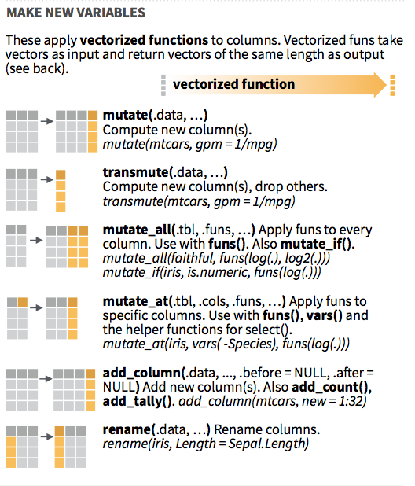

```{r setup, include=FALSE}
knitr::opts_chunk$set(echo = TRUE, eval = TRUE)
```


The core tidyverse includes the packages that you're likely to use in everyday data analyses. Let's explore some of the functions using a dataset of passengers on the Titanic. This exercise is a modification of the DataCamp [Introduction to Tidyverse](https://github.com/datacamp/datacamp_facebook_live_intro_to_tidyverse).

You can execute chunks by clicking the *Run* button (green arrow) within the chunk or by placing your cursor inside it and pressing *Cmd+Shift+Enter* or *Ctrl+Shift+Enter* on Windows. 

First, we will install the tidyverse package

```{r message = FALSE}
# Install the tidyverse
#install.packages("tidyverse")
```

Now that you've installed the tidyverse, it's time to load your package and data. Check out some of the observations.

In this code along session, you'll be exploring the [Titanic dataset](https://www.kaggle.com/c/titanic), where each observation is a person and each variable is a feature such as "Name", "Age" and "Survived" (or not). We will be exploring this data using tidyverse with a focus on [dplyr](http://dplyr.tidyverse.org/) for data wrangling and [ggplot2](http://ggplot2.tidyverse.org/) for data visualization

Load your data:

```{r message = FALSE, warning=FALSE}
# Import the Tidyverse
library()
# Import data
passengers <- read_csv()
# Check out the first several observations of your dataframe
```

What are all of these variables? See [dataset description](https://www.kaggle.com/c/titanic/data) for more details.

Code using tidyverse syntax starts with `data` and is followed by one or more `verbs` to be done to the data. The data and verbs are linked together using `%>%` which is called a pipe. You can type out the pipe operator or use the shortcut *Cmd+Shift+M*.  

To get an overview of your data, use the function "summary":

```{r message = FALSE}
# Summary titanic using base R syntax

```

Now do the same using a pipe, one of the handiest tools in the tidyverse:

```{r message = FALSE}
# Summarize titanic using a pipe


```

You may have noticed stylistic consistency in the code that we've written above. That's because we're adhering to a style guide. In data science *and* programming/coding in general, it's important to get accustomed to using a style guide asap. As Hadley Wickham puts it in the [tidyverse style guide](http://style.tidyverse.org/index.html),

> Good coding style is like correct punctuation: you can manage without it, butitsuremakesthingseasiertoread.


Now let's add `drop_na()` before the `summary()` function. What do you think will happen? 

```{r message = FALSE}
# Summarize titanic after dropping na


```

Note, that there is a pipe operator between each function. 

**Recap:**

* You've imported your data & checked it out
* You've learnt about the pipe operator `%>%`

**Up next:**

* Data wrangling with `dplyr` to **filter** your data, **arrange** it and create new features by **mutating** old ones.

## Wrangle your data

Now it's time to explore your data and get some initial insight into the dataset. You'll be using `dplyr` **verbs** such as `filter`, `arrange` and `mutate`, which do exactly what they say. 

Let's sat that we wanted to choose a particular set of observations, say, those for which the "Sex" was 'female'. `dplyr` allows us to do intuitively and in a language that mirrors how we think and talk about data.

The `filter` verb chooses only the observations that match the condition. See it in action:

```{r message = FALSE}
# Filter to get all "male" rows


```

**What can you see here?** Any ideas about whether men are likely to have survived or not?

**Note**: 

* you can read `dplyr` code like a sentence: take your data and then (`%>%`) filter it according the condition that the sex is male.
* the above does **not** alter the original dataframe.
* `filter(Sex = "male")` is a common error (I've made it); there's a cool [tidyverse error guide](http://style.tidyverse.org/error-messages.html). We will go into errors in more detail in a bit. 

```{r message = FALSE}
# Filter to get all "female" rows


```

**What can you see here?** Any ideas about whether women are likely to have survived or not?

Lets say you wanted to `arrange` your observations by increaing Fare to see if you can notice any trends. How can we use the **verb** `arrange` to achieve this? 

```{r message = FALSE}
# Arrange by increasing Fare


```

**What can you see here?** 

You can also `arrange` by decreasing Fare:

```{r message = FALSE}
# Arrange by decreasing Fare


```

**What can you see here?** 

Sometimes you may wish to create new variables. We know that the variable "Parch" is the number of parents and children while "SibSp" is the number of siblings and spouses. We can add these together to get a new variable "FamSize". To do so, you `mutate` the original variables into the new one.

```{r message = FALSE}
# Create new column FamSize (size of family)


```

**Note:**

* `mutate()` can be used to create new columns but also modify existing columns in much the same way that a mutation may from a biological perspective. It's not exactly right but a nice way to provide context for verb choice.
* The `dplyr` [cheatsheet](https://www.rstudio.com/resources/cheatsheets/) has useful visualizations for the different ways to create a new variable.



Is it possible that larger families have a lower rate of survival?

To test this hypothesis, create a new variable "FamSize" as the sum of "Parch" and "SibSp" as above, then arrange by decreasing "FamSize":

```{r message = FALSE}
# Create new column FamSize (size of family)
# Arrange by decreasing FamSize
passengers %>% 
  mutate(FamSize = Parch + SibSp) %>% 
  
```


**Try on your own**

We are interested in how different passenger characteristics relates to survival. As we move on to the next steps, we might want a more informative survival data than the current `Survived` data which is represented as zeros and ones. We can mutate the values of the "Survived" variable to strings "No" and "Yes" using the `ifelse()` function. Use the `?function()` syntax to look up the manual page for the `ifelse()` function.  What do you think the code should be? 

*hint: if you're stuck review the anatomy of a manual page*


```{r message = FALSE}
# Turn numerical values of Survived column to "No" & "Yes" 
passengers %>% 
  mutate(Survived = ifelse())

```


So far, our new variables have just been printed to the console, but not saved. If we want to explore our new variable further we will save it as a new dataframe called `passengers1`. The way we create and save this new object is similar to how the data was loaded using assingment arrow `<-`. The shortcut for the assignment arrow is *option+dash*.  

```{r message = FALSE}
# Turn numerical values of Survived column to "No" & "Yes" ( and save to new dataframe)


```


Commonly used verbs (`dplyr` package): 

* select()	select columns
* filter()	filter rows
* arrange()	re-order or arrange rows
* mutate()	create new columns
* summarise()	summarise values
* group_by()	allows for group operations in the “split-apply-combine” concept

Reference the `dplyr` [cheatsheet](https://www.rstudio.com/resources/cheatsheets/), or [package vignette](https://cran.r-project.org/web/packages/dplyr/vignettes/dplyr.html) for more details. 


**Recap:**

* You've imported your data & checked it out
* You've learnt about the pipe operator `%>%`
* You can now use `dplyr` to wrangle your data: `filter` it, `arrange` it and create new features by `mutating` old ones.


**Up next:**

* You'll learn how to easily and intuitively plot your data using `ggplot2`.


## Plotting your data

To plot your data using `ggplot2`, you specify three things:

* Your data (`passengers1`)
* Your aesthetics (e.g. at minimium what's on the x-axis)
* Your layers (e.g. barplot, scatterplot)


First you'll plot a barplot of Sex to see how many males and females were recorded aboard the Titanic:

```{r message = FALSE}
# Plot barplot of passenger Sex


```

**What can you see here?** 

**Note:**

*  the `aes()` function is really a way to map the `aes`thetics of the plot to the variables in the data. See [Modern Dive](http://moderndive.com/3-viz.html#grammarofgraphics) by Chester Ismay & Albert Y. Kim for more.

Now it's time for some scatter plots. Is the Age of any given passenger correlated with the Fare that they paid?

```{r message = FALSE}
# Scatter plot of Age vs Fare


```

**What can you see here?** 

**Note:**

* You can read your `ggplot2` code like a sentence, just like your `dplyr` code above: "We take the data as titanic and we map Age to the x axis and Fare to the y axis, adding points on as the layer of the plot."

Recall that we describe the strength of correlation ($\rho$), and if the correlation between the two variables is greater than chance. 

```{r}
#correlation test of Age vs Fare
#cor.test()

```

**How would you interpret the output?**

Let's take the previous plot and color each point by Sex, to see any correlations between Sex, Age and Fare:

```{r message = FALSE}
# Scatter plot of Age vs Fare colored by Sex


```

**What can you see here?** 

Visualizing three variables on one plot is pretty cool, but what if wanted to throw the Survived variable into the mix to see if there are any apparent trends?

Faceting is a way to produce multiple plots simultaneously:

```{r message = FALSE}
# Scatter plot of Age vs Fare colored by Sex faceted by Survived


```

**What can you see here?** 

Now let's redo our bar plot of passenger "Sex" and this time fill our bars according to "Survived":

```{r message = FALSE}
# Plot barplot of passenger Sex & fill according to Survival


```

**What can you see here?** 


**Recap:**

* You've imported your data & checked it out
* You've learnt about the pipe operator `%>%`
* You can now use `dplyr` to wrangle your data: `filter` it, `arrange` it and create new features by `mutating` old ones.
* You've learnt how to easily and intuitively plot your data using `ggplot2`.

This was a first introduction to `ggplot2`, but we will be returning to data visualizations often. 
Reference the `ggplot2` [cheatsheet](https://www.rstudio.com/resources/cheatsheets/), or the [many examples](http://r-statistics.co/Top50-Ggplot2-Visualizations-MasterList-R-Code.html) for more details. 


**Up next:**

* Learn how to summarise your data across many dimensions, such as "Sex".


## Summarizing and grouping your data

Use the `summarise` verb to find out the mean fare paid:

```{r message = FALSE}
# Check out mean Fare


```

Use the `summarise` verb to find out the median fare paid:

```{r message = FALSE}
# Check out mean Fare


```

**Note:**
  The British (`summarise()`) and American (`summarize()`) english spelling of the verb are interchangeable. 
 
Use the `filter` and `summarise` verbs to find out the mean fare paid among women:

```{r message = FALSE}
# Check out mean Fare for women


```

Use the `filter` and `summarise` verbs to find out the mean fare paid among women **and** how many women survived:

```{r message = FALSE}
# Check out mean Fare & number of survivors for women


```

Use the `group_by` and `summarise` verbs to find the mean fare and number of survivors as a function of sex:

```{r message = FALSE}
# Check out mean Fare & number of survivors grouped by Sex


```

Use the `group_by` and `summarise` verbs to find the mean fare and proportion of survivors as a function of sex:


```{r message = FALSE}
# Check out mean Fare & proportion of survivors grouped by Sex


```

**Recap:**

* You've imported your data & checked it out
* You've learnt about the pipe operator `%>%`
* You can now use `dplyr` to wrangle your data: `filter` it, `arrange` it and create new features by `mutating` old ones.
* You've learnt how to easily and intuitively plot your data using `ggplot2`.
* You've learnt how to summarise your data across many dimensions, such as "Sex".


**Up next:**

* Break! 
* Troubleshooting errors (lecture)

##  Exploring further

We will now use some of the skills we've just learnt to answer a our own questions! 

As a group: 

1.  Develop a question that can be answered with the `passengers1` dataset. See [dataset description](https://www.kaggle.com/c/titanic/data) for more details on each of the columns.
2.  Talk through how the data needs to be manipulated to get the appropriate answer. Would plotting the data be useful? Which verbs will you use and in what order? 
3.  Write the code for the analysis. Designate a computer that will have the completed code. If you are not actively typing, you can help your group by thinking about what should come next or proof reading what has already been typed. Be sure to test your code often. 


```{r, eval = TRUE}
#write your analysis here


```

4. When you are finished:
  - save the file with your group number (ie. `W1_Group1.Rmd`)  
  - Knit the `.Rmd` (short for RMarkdown) to HTML using the Knit button. Open the HTML, what does it look like? We will explore this more during the next workshop. 
  - email the `.Rmd` to your group members and Ania (majewska@uga.edu). 


