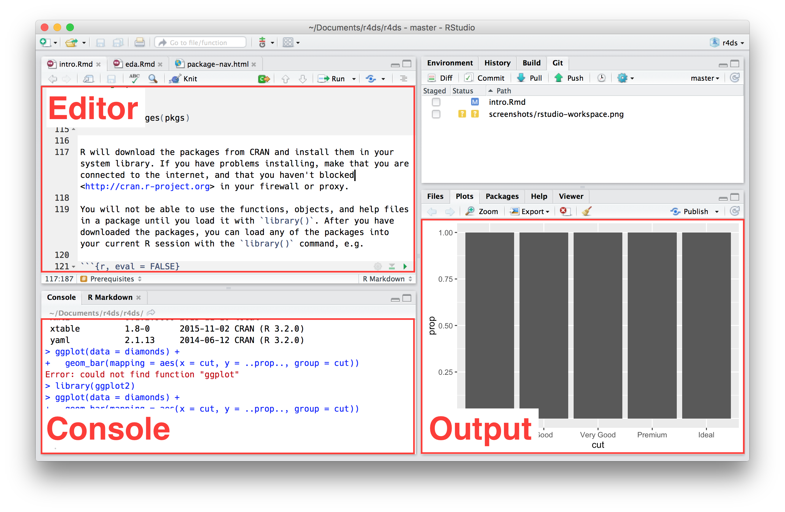

```{r setup, include=FALSE}
knitr::opts_chunk$set(echo = TRUE, eval = FALSE)
```

# Introduction to the series

This is the first of four sessions on using `R` and R Studio as part of your research process. These workshops were designed for you to develop a foundational understanding of `R` programming. This will not be an exhaustive course, but instead focuses on giving you the skills needed to learn the skills your particular project requires. The exercises used throughout the series were chosen because they mirror tasks a typical REU student might need to complete. 

The first two workshops focus on covering the basics of `R` and R Studio for scientific research. The third workshop focuses on infectious disease modeling which is a key tool used in the field. Finally, the last workshop covers data visualization. This workshop will be a useful reference when creating the [scientific posters](http://reu.ecology.uga.edu/?cat=34) you'll be presenting at the end of the REU program. Each workshop is led by a different instructor and are happy to help with follow up questions. 

You will have a short reading to be completed before each workshop. The reading will introduce important topics. Examples of `R` code use the `Courier New` font with grey highlight. 

As I've already mentioned, the exercises focus on authentic tasks. This approach prioritizes task completion over detailed technical knowledge of programming in `R`. If you're working on a quantitative project or are just curious, I suggest [R for Data Science](http://r4ds.had.co.nz/) or the [Introduction to R free course from DataCamp](https://www.datacamp.com/courses/free-introduction-to-r). 


# Introduction to R 

The topics covered in this workshop include:

  1. What is `R` and R Studio? 
  2. Introduction to data with tidyverse
  3. Troubleshooting 
  4. Exploring data
  

## 1. What is R and RStudio

`R` is a programming language and environment commonly used in many scientific fields. The open-source software is maintained by [CRAN](cran.r-project.org) with contributors from all over the world. Since `R` is open-source, the software is freely available and has constantly expanding capabilities.  

R Studio is a user friendly R working environment that makes it easy to organize projects and provides several improvements over the default R working environment such as providing an integrated full featured script editor and remembering all graphics outputs for a session. It is available for most operating systems (windows, mac, and linux), and can be downloaded here: http://www.rstudio.com/


### The four windows

Editor (upper left): this window only appears when you have an open file. This window contains the RStudio script editor. It colors different types of code differently. For example, functions and named objects are colored black, numbers are colored blue, and operators are colored gray. It allows you to execute lines of a script individually or in bulk by selecting the lines of code you wish to execute and hitting the "Run" button near the upper right hand corner of the window, or by hitting "ctrl+enter". Note that when your run any code, it is sent to the R console window to be executed.

Console (lower left): this is the command line prompt within R. Code can be sent here from the scripting window, or typed or pasted here directly.

Output and miscellaneous window (lower right): this window has several tabs. Files shows all of the files in the directory you are currently working from. Plots shows the output of all R graphics commands that have been executed during a session. Packages shows what libraries are available and which are currently loaded. Help shows help ???les that have been queried.

The workspace/ history window (upper right): This window has two tabs. Workspace shows you all of the objects currently in memory. History shows you all of the commands that have been executed during a session. Note that the Workspace tab can be used to import data using the Import Dataset button, but this is generally better done manually using commands such as "read.csv" in the script window or the R console.





### Packages

`R` "packages" are libraries of code, specialized collections of functions (and often data), most of which are not part of the core `R` package. Many of them implement specialized statistical or numerical methods that would not be covered in typical courses. For example, deSolve is a package that allows users to numerically solve differential equation models. Differential equation models are often used to represent the dynamics of epidemics, so tools for solving them can be very useful to scientists studying infectious diseases. Packages that are loaded into or are currently active in R are referred to as "attached". In RStudio, new packages can be downloaded and installed by clicking on the "Tools" tab and selecting install packages.

### R Markdown (.Rmd)

RStudio has developed different file types that allow the user to mix different types of programming language together. The most common file type used is `.Rmd`, which stands for R markdown. This file type can accept `R` code, html markdown, and latex to produce html, pdf, word, and slides. The exercises, readings and slides were all made using `.Rmd` files. The final document is produced by compiling or knitting the `.Rmd`. 

If you have never used a markdown language before check out the [R Markdown cheat sheet](https://www.rstudio.com/wp-content/uploads/2015/02/rmarkdown-cheatsheet.pdf). 

Most of the `R` code in a `.Rmd` needs to be within a code chunk which starts with three back ticks followed by a lower case r within curly brackets (```{r}). The code chunk ends with three back ticks. There are other options that can be included in the curly bracket follow the lower case r (See the [cheat sheet](https://www.rstudio.com/wp-content/uploads/2015/02/rmarkdown-cheatsheet.pdf)). 

You can execute chunks by clicking the *Run* button within the chunk or by placing your cursor inside it and pressing *Cmd+Shift+Enter* or *Ctrl+Shift+Enter* on Windows. 

## 2. Introduction to tidyverse

This first workshop jumps starts your `R` data manipulation and exploration skills with a code-along using `tidyverse`.

The tidyverse is a set of packages that work in harmony because they share common data representations and API design. The `tidyverse` package is designed to make it easy to install and load core packages from the tidyverse in a single command.

The core tidyverse includes the packages that you're likely to use in everyday data analyses, such as [ggplot2](http://ggplot2.tidyverse.org/) for data visualization and [dplyr](http://dplyr.tidyverse.org/) for data wrangling. You'll focus on these two during the code-along. 

Code using tidyverse syntax starts with `data` and is followed by one or more `verbs` to be done to the data. The data and verbs are linked together using `%>%` which is called pipe. You can type out the pipe operator or using the shortcut *Cmd+Shift+M*. The `tidyverse` syntax is an alternative to standard `R` (commonly called 'base `R`'). We are starting with `tidyverse` because it is easier for novice programmers to understand. As your `R` programming skills develop you might find yourself switching between base `R` and `tidyverse`.  

Here is a quick overview of [differences between base R and tidyverse](http://www.science.smith.edu/~amcnamara/blog/teaching/2018/02/11/Syntax-comparison.html?utm_content=bufferc6c7a&utm_medium=social&utm_source=twitter.com&utm_campaign=buffer) `R`.


## 3. How to get unstuck

I major part of *learning to learn* is developing troubleshooting skills. Each package has a long-form description called a [vignette](https://cran.r-project.org/web/packages/rmarkdown/rmarkdown.pdf). Individual manual pages for functions can be pulled up within R Studio by preceding a function with '?' in the console. A double question mark searches function help pages. 

Manual pages follow a set format.

 

In addition to vignettes and manual pages package authors will often make guides or examples that are returned by a Google search. Once you have a  handle on a function or package, cheat sheets are a useful reference. R Studio has a few, but also a bank of user contributed cheat sheets. You'll often find these cheat sheets posted near computers in labs. 

### Error warnings

Error warnings are part of the coding process. Errors can be the result of a minor typo or a larger issue with the code. The first step of dealing with an error is trying to understand the error message returned. Since `R` packages are user contributed, the helpfulness of error messages differs from function to function. If you're struggling to understand an error message, Google is your friend. Goggling the error message normally returns a useful response on Stack Overflow, a blog post, etc. It is very unlikely that you're the first person to come across the error. 

The R Studio has a more detailed [help guide](https://www.r-project.org/help.html). 

# Other useful information

You'll notice stylistic consistency in the exercises. That's because we're adhering to a style guide. In data science *and* programming/coding in general, it's important to get accustomed to using a style guide asap. As Hadley Wickham puts it in the [tidyverse style guide](http://style.tidyverse.org/index.html),

> Good coding style is like correct punctuation: you can manage without it, butitsuremakesthingseasiertoread.

Part I of the [tidyverse style guide](http://style.tidyverse.org/index.html) would be most useful for beginners. It is OK to follow [other style guides](https://google.github.io/styleguide/Rguide.xml), just be consistent.  


