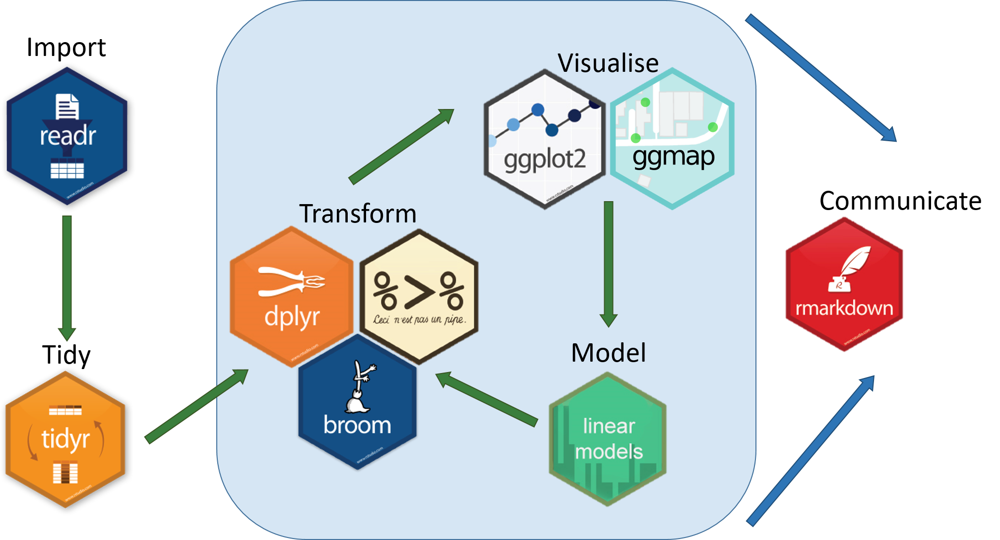

Introduction to R
========================================================
author: [NAME]
date: 
autosize: true
font-import: https://fonts.googleapis.com/css?family=PT+Sans
font-family: 'PT Sans', sans-serif;

***
<div class="midcenter"><div style="margin-left:-0px;margin-top:500px;"></img></div></div>


Why is R programming a useful skill?
========================================================
(John Drake)


About Myself
========================================================

 - My research interest is [INSERT DESCRIPTION]
 - I use `R` in my research to:
   + organize data 
   + develop machine learning algorithms
   + [INSERT DETAILS]
 - I mostly work [in this disease system or approach] 
 - My contact info is [INSERT EMAIL]
 

Workshop Goals 
========================================================
left:65%
**The workshop series** consists of four half day workshops each focusing on a different part of the research process
- Introduction to `R` (Today)
- Reproducible research (May 30; Robbie Richards)
- Simulating infectious diseases  (June4; John Vinson)
- Visualizing data (June 6; Michelle Evans)

***


Workshop Format 
========================================================

- Introduction of instructor & how they use `R`
- Review of past concepts
- Outline of the day's goals  
- Work through data analysis project  
- Reflection on day's materials

Expectations
========================================================
left:60%
**You**
- Come ready to participate
  + review the materials before hand
  + room tends to be cold
- Ask questions
- Help each other

***
**Instructor**
- Come ready to participate
- Help you find answers 
- Be a resource for you during the REU program

Outline 
========================================================
left: 40%

**At the end of this workshop you should be able to...**
- calculate summary statistics of a dataset
- create a figure from data
  
*** 

**Topics**
  1. What is `R` and RStudio?
  2. Introduction to with tidyverse with code along
  
  *Break*
  
  3. Troubleshooting   
  4. Exploring data in groups 
  5. Wrap Up 


1. What is R and RStudio? 
========================================================
left: 50%


* `R` is a free, open source programming language with a pre-set functionality (base `R`) 
* Functionality is extented by `R` packages which are collections of functions and data sets developed by the community.

***


* RStudio is a software program that makes `R` programming easier by:
  - write and test code efficiently
  - orginizing files into projects
  - intergrating different programming lanuguages (RMarkdown, Latex, etc.)
   

RStudio 
========================================================

Let's open today's exercise by clicking on W1_Exercise.Rproj in the W1_Exercise folder. 

RStudio should automatically open from here. 

RStudio 
========================================================


2. Introduction to tidyverse
========================================================  
left: 50%

- The tidyverse is a set of packages that work in harmony because they share common design. 
- Unique syntax used pipes (`%>%`) to connect data (object) to verbs (functions). 

***


tidyverse package
========================================================  
The tidyverse package is designed to make it easy to install and load core packages from the `tidyverse` in a single command.




Install tidyverse package
======================================================== 
- We need to install the `tidyverse` package. This can be done by clicking on buttons in Rstudio or from the console using `install.packages()`
- Install the package by running line 21 of the `W1_Exercise.Rmd` file


```r
# install all the packages in the tidyverse
install.packages("tidyverse") 
```


Load tidyverse package
======================================================== 
- Once a package is installed, we need to load it during our current R session. 
- This is done using `library()`.
- How should this code be altered to load the tidyverse library? 


```r
# load tidyverse library
library()
```


======================================================== 

Switch over to `W1_Exercise.Rmd`

========================================================
 
 <h1> *Break* </h1>

3. How to get unstuck: functions
========================================================
left: 35%
- Every function has a help page 
- `?function()` to access  

***


How to get unstuck: packages
========================================================
left: 50%
* Packages have a vignette and/or reference manual on [cran.r-project.org](cran.r-project.org)

* People often make their own tutorials too
***


How to get unstuck: packages
========================================================
left: 30%

 - Cheatsheets published by RStudio
 
***


https://www.rstudio.com/resources/cheatsheets/

How to get unstuck: packages
========================================================
left: 30%

 - Cheatsheets published by RStudio
 - Contributed cheatsheets 
 
***


How to get unstuck: error messages
========================================================


First, try to understand the error message. It can be very helpful. 

How to get unstuck: error messages
========================================================
left: 30%

 - But sometimes, the message is cryptic. So use google!   

***


  
4. Exploring further
========================================================
Let's work in small groups (max 3 people)

- Develop a question about that can be answered with this data
- Decide on the needed verbs, and order
- Write the code in the final code chunck of the `W1_Exercise.Rmd` file

More instructions in the file. 


5. Wrap Up
========================================================
left: 50%

**We can...**
- calculate summary statistics of a dataset
- create a figure from data
  
*using*
 - `dplyr` package
    -   filter, arrange...
 - `ggplot2` package
    -   geom_point, facet...
    
***


5. Wrap Up
========================================================
left: 50%

*Next*

  Focus on communication by following best practices for reproducible research 
    
***


