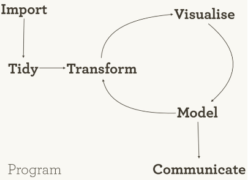
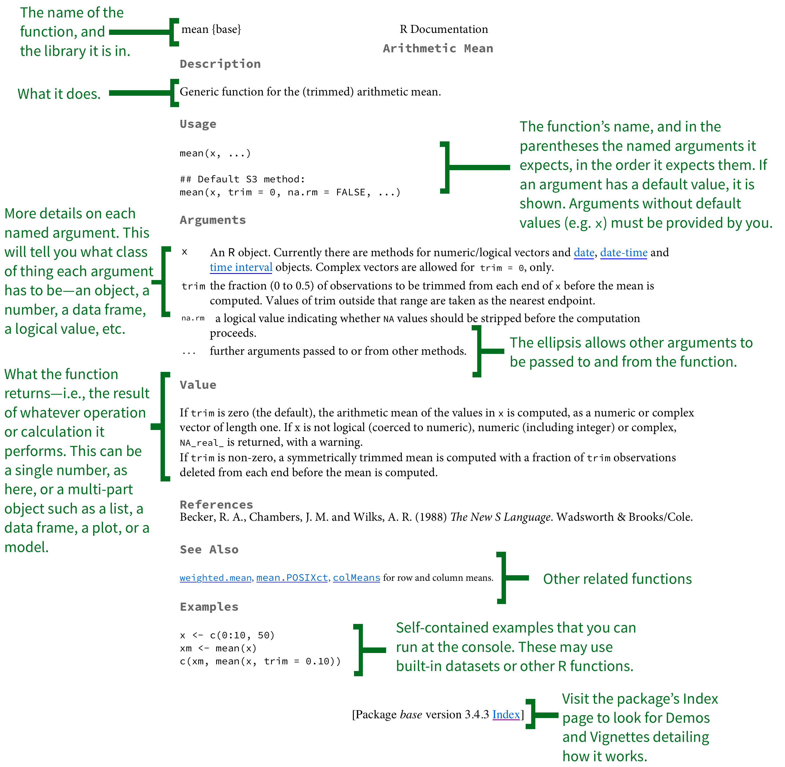
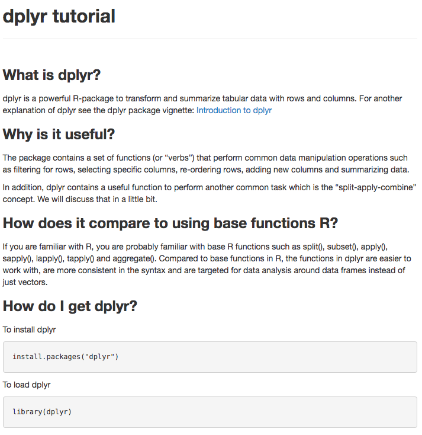
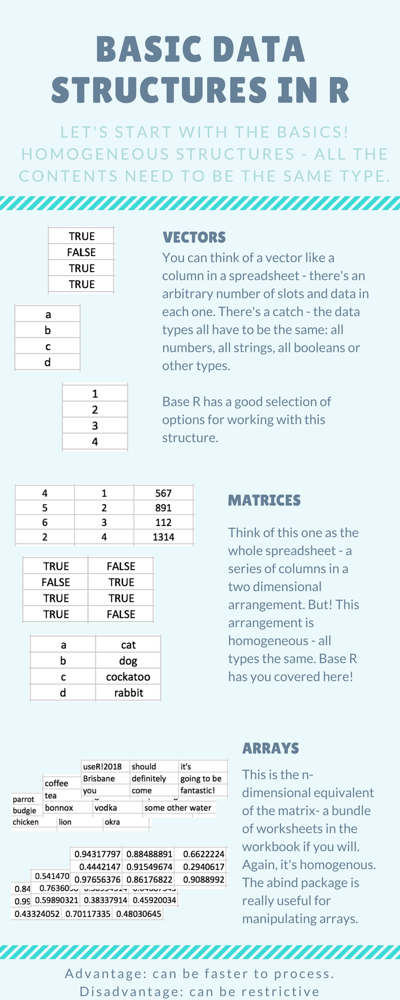

W1: Introduction to R
========================================================
author: Ania Majewska and Reni Kaul
date: May 22, 2019
autosize: true
font-import: https://fonts.googleapis.com/css?family=PT+Sans
font-family: 'PT Sans', sans-serif;

***
<div class="midcenter"><div style="margin-left:-0px;margin-top:500px;"></img></div></div>


Why is R programming a useful skill? 
======================================================== 


About today's instructors
========================================================
Ania Majewska
 - My research interest is in conservation biology and disease ecology
 - I use `R` in my research to:
   + organize and wrangle data 
   + analyze data (statistical models)
   + model disease dynamics (transmission)
 - I mostly work on the monarch butterfly and it's protozoan parasite 
 - My contact info is majewska@uga.edu

About today's instructors
========================================================
Reni Kaul
 - I'm interested in understanding population extinctions
 - I use `R` in my research to:
   + organize data 
   + develop machine learning algorithms
   + model population dynamics 
 - I mostly work with microbial microcosm systems 
 - My contact info is reni@uga.edu


Workshop Goals 
========================================================
left:65%
**The workshop series** consists of four half day workshops each focusing on a different part of the research process
- Introduction to `R` (Today: Ania Majewska and Reni Kaul)
- Reproducible research (May 29; Deven Vishwas Gokhale and Reni Kaul )
- Simulating infectious diseases  (June 3; John Vinson)
- Visualizing data (June 7; Robbie Richards)

***




Workshop Format 
========================================================

- Introduction of instructor & how they use `R`
- Review of past concepts
- Outline of the day's goals  
- Work through data analysis project  
- Reflection on day's materials

Expectations
========================================================
left:60%
**You**
- Come ready to participate
  + do the reading
  + review the materials beforehand
- Ask questions
- Help each other

***
**Instructors**
- Come prepared
- Help you find answers 
- Be a resource for you during the REU program

Outline 
========================================================
left: 40%

**At the end of this workshop you should be able to...**
- calculate descriptive and inferential statistics of a dataset
- create a figure from data
  
Today
========================================================

**Topics**
  1. What is `R` and `R`Studio?
  2. Introduction to `R` and tidyverse 
  
  *Break*
  3. Code along exercise
  
  *Break*
  4. Troubleshooting   
  5. Exploring data in groups 
  
  *Break*
  6. Wrap Up 
  7. Datacamp.com


1. What is R and RStudio? 
========================================================
left: 50%

<div align="left">

</div>

* free, open source programming language with a pre-set functionality (base `R`) 
* Functionality is extented by `R` packages which are collections of functions and data sets developed by the community.

***

<div align="center">

</div>

* RStudio is a software program that makes `R` programming easier:
  - write and test code efficiently
  - organizing files into projects
  - intergrating other programming lanuguages (e.g., Latex)
   

RStudio 
========================================================

Let's open Rstudio!


RStudio 
========================================================


2. Introduction to tidyverse
========================================================  
left: 50%

- The tidyverse is a set of packages that work in harmony because they share common design. 
- Unique syntax used pipes (`%>%`) to connect data (object) to verbs (functions). 

***


tidyverse package
========================================================  
The tidyverse package is designed to make it easy to install and load core packages from the `tidyverse` in a single command.


Install tidyverse package
======================================================== 
- We need to install the `tidyverse` package. This can be done by clicking on buttons in Rstudio or from the console using `install.packages()`
- Install the package by running the line


```r
# install all the packages in the tidyverse
install.packages("tidyverse") 
```


Load tidyverse package
======================================================== 
- Once a package is installed, we need to load it during our current R session. 
- This is done using `library()`.


```r
# load tidyverse library
library(tidyverse)
```


======================================================== 

<h2> Download the W1_Exercise zip file </h2>

Unzip and open the folder.


========================================================
 
 <h1> *Break* 
 
Resume in 15 min </h1>

========================================================

<h2> Open W1_Exercise.Rproj

 Open W1_Exercise.Rmd </h2>


========================================================
 
 <h1> *Break* 
 
Resume in 15 min </h1>


3. How to get unstuck: functions
========================================================
left: 35%
- Every function has a help page 
- `?function()` to access  

***


How to get unstuck: packages
========================================================
left: 50%
* Packages have a vignette and/or reference manual on [cran.r-project.org](cran.r-project.org)

* People often make their own tutorials too
***


How to get unstuck: packages
========================================================
left: 30%

 - Cheatsheets published by RStudio
 
***


https://www.rstudio.com/resources/cheatsheets/

How to get unstuck: packages
========================================================
left: 30%

 - Cheatsheets published out by RStudio
 - Contributed cheatsheets 
 
***



How to get unstuck: error messages
========================================================


First, try to understand the error message. It can be very helpful. 

How to get unstuck: error messages
========================================================
left: 30%

 - But sometimes, the messages is cryptic. So use google!   

***


  
5. Exploring further
========================================================
Let's work in small groups (max of 3)

- Develop a question that can be answered with this data
- Decide on the needed verbs, and order
- Write the code in the final code chunck of the `W1_Exercise.Rmd` file

More instructions in the file. 


========================================================
 
 <h1> *Break* 
 
Resume in 15 min </h1>

6. Wrap Up
========================================================
left: 50%

**We can...**
- calculate descriptive and inferential statistics of a dataset
- create a figure from data
  
*using*
 - `dplyr` package
    -   filter, arrange...
 - `ggplot2` package
    -   geom_point, facet...
    
***


Wrap Up
========================================================
left: 50%


*Next week*

  Focus on communication by following best practices for reproducible research 
    
***


7. Datacamp.com
========================================================

We will be using datacamp.com to build more skills!
