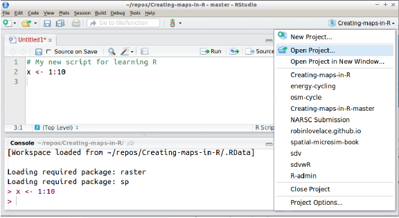

```{r setup, include=FALSE}
knitr::opts_chunk$set(echo = TRUE)
```

# What is reproducible research?

> Reproducible research is the idea that data analyses, and more generally, scientific claims, are published with their data and software code so that others may verify the findings and build upon them. 

<br>


<br>

The push for reproducible research practices arose from the [replication crisis](https://en.wikipedia.org/wiki/Replication_crisis) in science (but see [Fanelli, 2018. PNAS](https://doi.org/10.1073/pnas.1708272114)). The best practices that arose (publishing data, transparent methods, etc.) can also be thought of as a revolution in how we *should* be doing science based on the available technology and the universal need for increased transparency (See [Spellman, 2015. Perspectives on Psychological Science](http://journals.sagepub.com/doi/pdf/10.1177/1745691615609918)). 

The best practices for reproducible research fall into 3 categories: 

1. Reproducible workflow and dataflow practices
    - A reproducible *workflow* consists of data analysis that is a repeatable pattern of computational activities. Why might `R` coding be more repeatable than an analysis done in Excel? 
    - A *dataflow* is reproducible when variable changes (editing or adding raw data) impact downstream analysis. 
2. Literate statistical programming practices
    - *Literate programming* is an approach that natural language **explanations** are interspersed with computer code. *Literate statistical programming* is the mixing of natural language explanations with code that executes statistical analysis.  
3. Content of science archives
    - Publications should be accompanied by data and analysis that adheres to literate statistical programming practices. 

We will address the first two areas in the workshop. The third dictates that truly reproducible research must be archived in a way that allows others to recreate the original findings. Submissions to digital repositories are assigned a unique digital object identifier (DOI) which is referenced in the publication's methods or supplementary information. Commonly used repositories include [Dryad](https://datadryad.org/) and [figshare](https://figshare.com/). 

# Useful tools in RStudio

Data analysis in `R` makes reproducible workflow and dataflow possible. RStudio has a few additional tools to make reproducible research even easier. 

## Projects
 
 The directory that `R` looks for files referenced in the code is called the [working directory](https://en.wikipedia.org/wiki/Working_directory). You can manually set the working directory using `setwd(PATH/TO/DIRECTORY)` (print the current working directory using `getwd()`). Manually setting an absolute path to a working directory is just fine if that code will only ever exist on that computer in that location. 
 
 Manually setting working directories is the opposite of reproducible research. It also makes collaboration or trouble shooting by others nearly impossible. Absolute paths have even driven the notoriously nice Jenny Bryan ([\@JennyBryan](https://twitter.com/JennyBryan)) to [make statements](https://www.tidyverse.org/articles/2017/12/workflow-vs-script/) like this:
 
 > If the first line of your R script is <br>
 >
 > `setwd("C:\Users\jenny\path\that\only\I\have")` <br>
 >
 > I will come into your office and SET YOUR COMPUTER ON FIRE `r emo::ji('flame')`

Let's avoid any unnecessary computer sacrifices by using [RStudio Projects](https://support.rstudio.com/hc/en-us/articles/200526207-Using-Projects). 

You'll remember, we started the exercise in the first workshop by opening `W1_Excercise.Rproj`. I created this Project when I wrote the exercise. The Project automatically sets the working directory to the location that the `.Rproj` file is saved. It also automatically opens the files I was working on when I closed the Project. So in this case, clicking on `W1_Exercise.Rproj` would launch RStudio and open both `W1_Exercise.Rmd` and `W1_Exercise_soln.Rmd`

When you start a new analysis, start a new Project by:

1. Open RStudio
2. Choose "File" -> "New Project" 
3. From the pop up window click "New Directory", then "Empty Project"
4. Name your new directory. 
5. Use the "browse" button to choose the directory location. 

<iframe width="660" height="415" src="https://www.youtube.com/embed/hKoSJGWnFFA" frameborder="0" allow="autoplay; encrypted-media" allowfullscreen></iframe>

When you're finished working on the project for the day, close the project ("File" -> "Close Project"). When you open the project up again, all the documents you were working on will automatically re-open. 

You can also open and close Projects from a drop down in the upper right hand corner of RStudio. 



**Note:**

The `R project` is designed to integrate with the version control systems Git and Subversion through RStudio ([details](https://support.rstudio.com/hc/en-us/articles/200532077-Version-Control-with-Git-and-SVN)). Ask your lab if this is something you should be using. 


## Revisiting R Markdown 

We've already interacted with `.Rmd` files in RStudio. The exercise associated with the first workshop included `R` code chunks. The code was *commented* by lines started with a hash ("#"), while *commentary* or longer explanations where included outside of the code chunk. 

The comments and the commentary should include *why* you're pursuing an analysis or specific approach. It is easy to fall into the habit of commenting *what* the code should do when executed. This pseudocoding approach can be useful while you're writing the analysis, but be sure to periodically edit comments to include explanations. 
  
Incorporating explanations of your analysis through comments and commentary is an essential practice for literate statistical programming. When in doubt include a comment or commentary. At the very least, your future self will appreciate the notes. 


### Formatting in markdown

Markdown (or sometime referred to as markup) language is short hand for HTML code. RStudio has its own flavor "Rmarkdown" that allows for fast formatting of text. For instance, this document contains section headers, bold and italic text, code snippets, hyperlinks, and other typographic conventions. These are all readily introduced into R Markdown documents using some simple syntax.

The `W1_Exercise.Rmd` illustrated some of these. For example, attaching an URL to some other text  uses a combination of square brackets (for the text) and parentheses (for the URL), *i.e.*, `[This is the URL for R Markdown](http://rmarkdown.rstudio.com)`. The `W1_Exercise.Rmd` also included bold text, indicated by double asterisks around the text to be emphasized, and a code snippet (which isn't evaluated), indicated by single back ticks. Other common formatting is accomplished as follows:

* To italicize text, wrap it in single asterisks.
* Block quotes are indicated by right angle bracket (mathematical notation for "greater than").
* Equations (using \LaTeX markup language) are wrapped in dollar signs, for instance `$\frac{d}{dx}\left( \int_{0}^{x} f(u)\,du\right)=f(x)$` yields $\frac{d}{dx}\left( \int_{0}^{x} f(u)\,du\right)=f(x)$. Latex is a very extensive language for typesetting mathematical equations. It is outside of the scope of this workshop to teach, but if you are familiar with it already you may find it useful to integrate into your markdown documents.
* A new line is generated by a double hard return.

Section titles start on the second new line after some text and are preceded by a hash `#` indicating the section/sub-section level. For example, the code

```
# Header 1
## Header 2
### Header 3
```
produces

# Header 1
## Header 2
### Header 3

**Note the hash is interpreted differently inside of code chunks (comment) and outside of code chunks (header)**

Scientific documents often contain additional objects, such as lists, tables, and figures. Lists are easy to produce in R Markdown. Unordered lists (bullet lists) are started on the second line after some text and indicated by single asterisks. Sublists are indicated by indentation with four spaces. Thus,

```
* List item
* List item
    * Sub-list item
    * Sub-list item
```

produces

* List item
* List item
    * Sub-list item
    * Sub-list item

Numbered lists are similarly generated. Unnumbered and numbered lists may even be mixed. Thus,

```
1. List item
2. List item
    1. Sub-list item
    * Sub-list item
```

produces

1. List item
2. List item
    1. Sub-list item
    * Sub-list item


For more information on syntax see [R Markdown document guide](http://rmarkdown.rstudio.com/authoring_basics.html) or the [R Markdown cheat sheet](https://www.rstudio.com/wp-content/uploads/2015/02/rmarkdown-cheatsheet.pdf).

The `.Rmd` can also compile HTML code for more extensive formatting needs (i.e. text color).


The overall look of the document can be set in the header or YAML. Check out the [HTML document guide](https://rmarkdown.rstudio.com/html_document_format.html#code_folding) for more details. The table of contents (TOC) and code folding are extremely useful. 

The YAML for this document is:

```
---
title: "Reproducible research with R"
author: "PopBio REU 2018"
date: "Reni Kaul"
output: 
  html_document:
    toc: true
    toc_float: true
---
```

### Code chunk options

Most of the `R` code in a `.Rmd` is within a code chunk. The basic `R` code chunk can also be created by using *Cmd+Alt+i* or *Ctrl+Alt+i* on Windows shortcuts.


A code chunk is indicated by starting on a new line (usually with a hard return in between for clarity) with three back ticks. Typically, we will also want to specify how the code chunk will be evaluated (*i.e.*, we may pass in some *options*), in which case the back ticks are followed by a small number of commands in curly braces. The first of these is the letter "r", followed by a space, then a name for the code chunk (`{r Unique Name, OPTIONS}`). Note, that the first comma comes after the code chunk name. 

These options can be set for all code chunks in the document by including `knitr::opts_chunk$set(echo=FALSE)` in the first code chunk of the document. These global options are overridden by conflicting options set in a code chunk. 

Some useful options are:

* `eval` (whether or not to evaluate the code chunk)
* `cache` (whether to cache the results of the code chunk, for instance if the compute time is large)
* `echo` (whether or not to include the source code in your compiled document)
* `tidy` (whether or not the R code should be automatically tidied for presentation)
* `fig.keep` (whether or not to also save figures in their own file)
* `fig.path` (where to store figures)

All of the different chunk options can be found at [https://yihui.name/knitr/options/](https://yihui.name/knitr/options/). 

### In-line `R` Code

In some cases, it is useful to execute `R` code in-line with natural language. In-line code is designated by a single back tick followed by "r" and code you'd like executed. The in-line code is ended with another back tick.

Let's say I've calculate the mean age of survivors on the Titanic. I'd like to include this value in-line with some other commentary. 

```{r, eval=TRUE, echo=TRUE, warning=FALSE, message=FALSE, tidy=TRUE}
library(tidyverse)

passengers <-  read_csv("data/train.csv")

survived_Age <- passengers %>% 
                drop_na() %>% 
                filter(Survived == 1) %>% 
                summarize(mean(Age))

rtext <- "r round(survived_Age, digits = 1)"
```


I could include the value in my commentary by typing:

> The mean age of passangers that survived  is \``r rtext`\`.

-OR-

> The mean age of passangers that survived  is 32.9.

both render to:

> The mean age of passangers that survived  is `r round(survived_Age, digits=1)`.


**<i>How does in-line code relate to a reproducible workflow?</i>** 

# Postscript on best practices

One approach is to adopt the practice to *never change the raw data*. That is, once collected, cleaned, and organized, the raw data table for an analysis may be archived and the archived version considered to be fixed. But, what if an error is discovered? Or, more commonly, what if analysis requires some subset of the data or transformation of the data? The practice of literate statistical programming allows these operations to be included in the algorithm. That is, they are considered to be part of the work flow. If a data point needs to be changed, this can be done programmatically, in a *pre-processing* step that precedes the actual data analysis. Besides ensuring the stability of the underlying information, this approach also enables documentation of the rationale for any such changes to the data.

