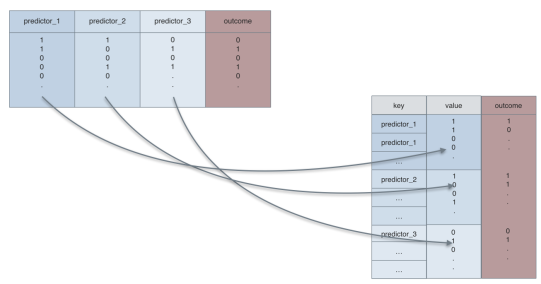

```{r setup, include=FALSE}
knitr::opts_chunk$set(echo = TRUE, eval = FALSE)
```


# Solving ODEs with lsoda

The function `lsoda()` (Livermore Solver for Ordinary Differential Equations) is part of the `deSolve` package. Let's start by installing and loading the `deSolve` package

```{r start up, message=FALSE, warning=FALSE}
# install deSolve package (if not already); make sure to comment install package command before compiling

# load deSolve library

# load some of the other libraries we will need later on
library(tidyverse)
```
 
 
Now that the library is loaded, look at the manual page for lsoda. Interpret the first 4 arguements.

- y 
- times
- func
- params

*Note: Line within the r chunks starting with* `##` *need to be completed or edited*

## Writing a function for lsoda

Based on the manual page, we know lsoda is expecting a model in the form of `func <- function(t,y,parms)`. 

Let's convert the exponential growth function into this form. 

$$\frac{dN}{dt} = rN$$

```{r Exp Growth}
ExponentialGrowth <- function(t, y, params) {
# Computes the rate of change of the variable y over time
#
# Args:
#   t: vector of time points in the integration
#   y: vector of variables in the differential equation
#   params: vector of parameter values
#
# Returns:
#   The rate of change of the variable y.

  N <- y # create local variable N

  # the argument to "with" lets us use the variable names
  with(as.list(c(params)), { 

#Complete the function to:
    ## Right hand side of the differential equation
    ## combine results into a single vector dx

    list(dx) # return list of results
    }
  )
}  

```

## Other arguements for lsoda

**Parameters**
So now that we have the model written, let's tackle the other arguements starting with `params`. 

What are the parameters in the exponential growth model? What are they called in the `ExponentialGrowth()` function? 

*Remember: We can save values to a named object by using redirecting the output using the `<-` syntax *

```{r param values}
# the only parameter in the exponential growth model is the grawth rate (r). Let's define r=0.75
parameters <- c(r = 0.75) 
```

**Time**

Working backwards the next arguement for `lsoda()` is `times`. The solver needs to know when to report the numerical solution for the ODE. Let's create a vector called `t.vector` starting at 0.1 and increases by 0.1 up to 1. 

*Remember: We can save time when making patterned vectors by using* `seq()` *function. If you are having trouble figuring out how to use the function you can view the help file with* `?seq`
```{r time}
## t.vector <- seq()
```


**Initial condition of state variable(s)**

The initial condition of the state variable(s) is set by a named vector, just like the parameters values. Let's create a vector `y0` with an initial state value (N0) of 10.

```{r initial condition}
## y0
```

## Run a simulation

We now have a function called `ExponentialGrowth()` that describes the exponential growth model the 3 required arguements for the `lsoda()` function. Let's simulate the population and save it as an object called `sim1` 

```{r exp population simulation}
##sim1 <- lsoda(y = y0, times = , func = , parms = ) #complete the arguements
```

What is the population size at the end of the simulation? How would you expect it to change if the growth rate was decreased? Test it out by creating another simulated population named `sim2` with this new growth rate. 

```{r exp population sinulation low growth}
##parameters2 <- c() # create a new vector for the params arguement

##sim2 <- lsoda(y = y0, ) # complete the arguements 
```

## Plot the simulation 

In some situations, plotting the simulation(s) is more informative than looking at the print out. We can create a scatter plot using `ggplot() + geom_point()` syntax. 

Try plotting `sim1` with time on the x-axis. 

```{r sim1 plot,  error = TRUE}

##ggplot(data = , aes(x = , y = )) + # complete the code with the appropriate data, and x-y aesthetics 
  geom_point() 

```

You'll notice that this code returns an error instead of a plot. 

Use google, `str()`, `?ggplot()`, and the ggplot cheatsheet to interperet the error. What does the error mean? 

```{r sim1 error problem solving}

str(sim1) # use the `?` to look up the str() function

#?ggplot()
```

The `ggplot()` function requires data in a data.frame. What is the current object class? Any ideas on how can we convert `sim1` and `sim2` to a data.frame?

```{r plotting exp model}
sim1 <- as.data.frame(sim1) # convert sim1 to a data.frame for plotting  
##sim2 <- as.data.frame()  # convert sim2 to a data.frame as well

# plot sim1 as points (from sim1 plot code chunk)
ggplot(data = sim1, aes(x = time, y = N0)) + 
  geom_point() +
  geom_line()

```

*Note: The* `sim1 <- as.data.frame(sim1)` *code writes over the old version of sim1.*

### Plotting multiple data objects in a single plot

The `ggplot` syntax has a layered design. You can add layers to the plot by using the `+`. This works for adding different elements for the same dataset like the code chunk above, but also can be used to pull in another dataset. 

Let's use the `geom_point()` and `geom_line()` to add the `sim2` data to the `sim1` plot. 

```{r}
# start with the original sim1 plot (sim1 plot code chunk)
ggplot(data = sim1, aes(x = time, y = N0)) + 
  geom_point() +
  geom_line() + 
 # we can add points and lines from sim2 by calling the sim2 data, and defining the aesthetic
  ##geom_point(data = , aes( )) +  
  ##geom_line(data = , aes( ))


```

*Note:*

- The `ggplot()` call can be saved to an object using the `<-`
- layer can be added to the saved object using the same `+` syntax
- The saved `ggplot()` object can be plotted by calling the object 

```{r ggplot object example}
# save the sim1 plot as an object
p <- ggplot(data = sim1, aes(x = time, y = N0)) + 
      geom_point() +
      geom_line()

p # call the object p plots the figure 


# add sim2 data to the plot `p`
p + geom_point(data = sim2, aes(x = time,y = N0)) + 
    geom_line(data = sim2, aes(x = time,y = N0), color = 'red')
  
  

```


**Recap:**

- You've written a function based on an ODE model
- You've simulated data based on an ODE model
- You've plotted multiple simulations on the same plot

**Up Next:**

- Break! 
- We will simulate a susceptible-infected-recovered (SIR) model


# Simulating an outbreak with an SIR model

You will build on the exponential growth model to make an SIR model and simulate an outbreak. Work in groups of 2-3. 

Steps:

1. Using ExponentialGrowth as a guide write a `DensityDepSIR()`
2. Run a simulation using the parameter values (beta, gamma) and initial state conditions (S=,I=,R=)
3. Plot the simulation

Each of the steps is broken down with prompts. Work through the code chunks. Stop at the next  **Recap** section. 

## 1. Write `DensityDepSIR()`

The SIR model with density dependent transmission takes the following form: 

$$\begin{aligned}
\frac{dS}{dt} &= -\beta SI \\
\frac{dI}{dt} &= \beta SI-\gamma I\\
\frac{dR}{dt} &= \gamma I
\end{aligned}$$

```{r SIR model}

DensityDepSIR <- function(t,x,params){
  # Computes the rate of change of the variables S, I and R over time
   #
   # Args:
   # t: vector of time points in the integration
   # x: vector of variables in the differential equation
   # params: vector of parameter values
   #
   # Returns:
   # The rate of change of the variables S, I and R.
    
   S <- x[1] #create local variable S, the first element of x
   I <- x[2] #create local variable I
   R <- x[3] #create local variable R
  
  
   with( #we can simplify code using "with"
   as.list(params), #this argument to "with" lets us use the variable names
   { #the system of rate equations

#Complete the function for:
     
    ## expression for dS
    ## expression for dI
    ## expression for dR

     dx <- c(dS,dI,dR) #combine results into a single vector dx
     list(dx) #return result as a list,
     #note order must be same as the state variables
     }
     )
}

```


## 2. Simulate an outbreak 

Sometimes it is more informative to model the proportion of the population in the S,I, and R classes. We can simulate the fraction of the population instead of total individuals by changing the initial conditions to a fraction. In the case of the initial conditions below, the simulation will start with 1 infected individual in a population of 1,000. 


```{r SIR parameters and initial conditions}
# time points for the integration
t.SIR <-seq(0,120,by=5)

# Initial conditions S,I,R
xstart<- c(S=999/1000,I=1/1000,R=0)

# parameter values
SIRparameters <- c(beta=0.3, gamma=1/7)

```


```{r simulate SIR}

# simulate an outbreak
##SIRsim <- as.data.frame(lsoda()) #complete the code

```

*Notice as.data.frame wraps around the lsoda command*

## 3. Plot the simulation

The `SIRsim` object is already a data.frame and a single class can be easily plotted using `ggplot()`. How do you think the infected class will change over time? Plot the Infected class to check your thinking. 

```{r plotting I class}
##ggplot() +
  geom_point() +
  geom_line() 
```

It would be useful to see how the S, and R class are changing over time too. We could add layers with S and R as x values in the `aes`thetic but there is a faster way. 

The data is currently in wide format (ie. S, I, and R at a given time are all in the same row). We can convert `SIRsim` to long format using the `gather()` before plotting. The long format data is preferable for data analysis in `R`. 




Long format has a single observation per row. See this [blog post](
https://sebastiansauerblog.wordpress.com/2016/07/13/long-vs-wide-format-and-gather/
) for more details. 

Explore the `gather()` function. Once you have a handle on the `gather()` function make a new long format `longSIRsim` object and plot. 

How do the column names change between `SIRsim` and `longSIRsim`?

```{r long format SIR}

##longSIRsim <-  %>% 
              gather(key = state, value = value, S:R)

##ggplot(, aes(time, value, color = state)) + 
    geom_line()

```


*Note:*
 Tidyverse pipes can feed directly into ggplot. Here, the `data` arguement for `ggplot()` is not needed, the output of the pipe from the line above is automatically used. For consistency, you can use a `.` (period) for the `data` arguement but it isn't required. 

```{r fast SIR plot}

SIRsim %>% 
  gather(key = state, value = value, S:R) %>%  # the gathered data is fed directly into ggplot without creating a secondary object. 
  ggplot(data = ., aes(time, value, color = state)) + 
    geom_line()


```


**Recap:**

- You've simulated and plotted data for an exponential growth model
- You've simulated and plotted data for an SIR model

**Up Next:**

- Explore the impact of parameter values on the SIR model


## Challenge: Parameter values of an SIR

Explore the impact of the $\beta$ and $\gamma$ values on the size and duration of the outbreak. Remember you can address each question in separate code chunks. 

- What happens when $\gamma$ is increased? 
- What happens when $\beta$ is increased? 
- What happens when the ratio of is held constant but the absolute values change?
- What is $R_0$? How would you derive this value for the model we've been using?
- How do these parameter values influence $R_0$? 

Be sure to run your simulations long enough to see the equlibrium values. 

*Remember best practices*

**Start code chunk for param exploration here**


---
**Recap:**

- You've simulated and plotted data for an exponential growth model
- You've simulated and plotted data for an SIR model
- Explore the impact of parameter values on the SIR model

**Up Next:**

- Iterating in `R`

# Iteration using exponential growth as an example

The Euler method and the `lsoda()` algorithm are an examples of iteration or repeating a process over and over. Iteration can be a common part of data analysis and is implimented in `R` using loops. Loops come in 3 flavors:

- For loop: repeated a set number of times
- while loop: repeated until a condition is met (could be zero times)
- repeat loop: repeated until a condition is met (completed at least 1 time)

Let's explore the For loops with the exponential growth model.  

**What is population size at next time step?**

We can calculate the $N_{t+1}$ given a population size of 10 and a 2% growth rate ($N_t = 10$ and $r=0.02$). 

```{r One step at a time}
##Nt <-  # starting population
##r <-  # population increases 2% each time
Nt1 <- Nt + r*Nt
```

**What is population size at 100th time step?**

We could repeat the previous code chunk 100 times, or use a For loop. 

The basic syntax of a `for` loop is:

```{r}
for(i in 1:10){
  print(i)
}
```

What is the output of this loop? 

Let's use the For loop syntax to calculate the population size at t+100

```{r t100}
N.seq <- c(rep(0,100)) # make a vector where the calculations will be stored. 
N.seq[1] <- 10 # set the current population size to 10 

for(i in 1:100){
    ##N.seq[] <- N.seq[] + (r*N.seq[])
}

N.seq

```

**Concept check:** What would the N.seq vector look like if the for command was changed to:

  - `for(i in 1:50)`?
  - `for(i in 50:100)`?
  
Re-run the loop with the new commands to check your answers. 

**Note:**

- For loops are *slow* but easy 
- If you need to iterate over more than a few thousand look into using `apply()` functions

DataCamp has a more extensive [tutorial of loops](https://www.datacamp.com/community/tutorials/tutorial-on-loops-in-r)

