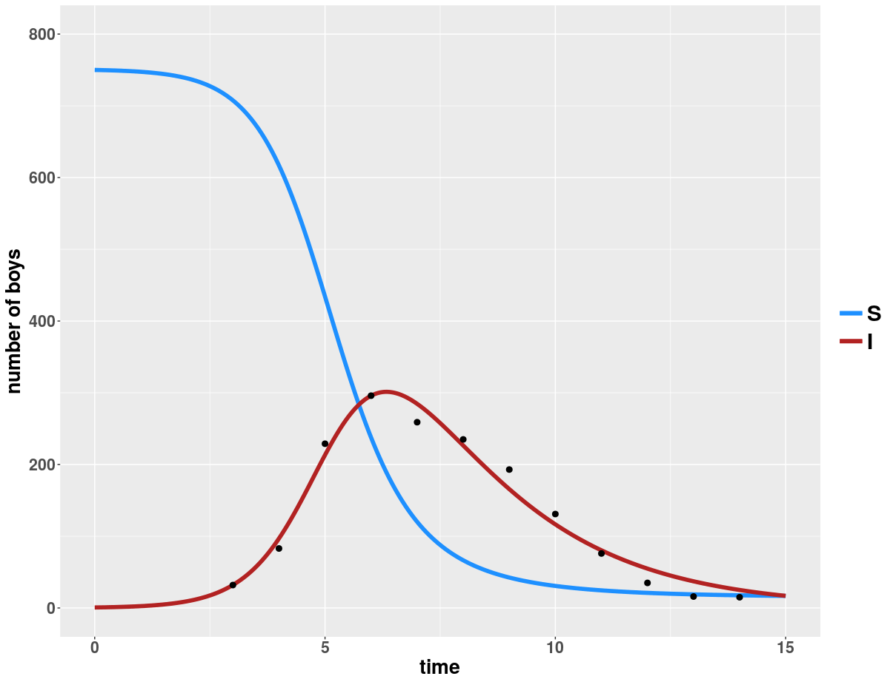
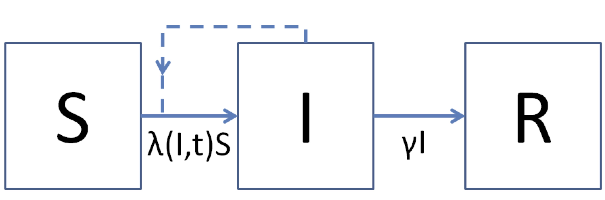

```{r setup, include=FALSE}
knitr::opts_chunk$set(echo = TRUE, eval = FALSE)
```

The first two workshops focused on developing `R` programming skills. The third workshop is slightly different in that it focuses on a sinlge task. This workshop will cover simulating infectious diseases. Before covering the programming aspect, we need to cover the conceptual details of population models.    

# Introduction  
Infectious diseases cause a substantial global burden of morbidity and mortality. Understanding infectious diseases involves multiple facets including medicine, microbiology, genomics, immunology and vaccine and drug development. However, none of these approaches address important questions at the population level.



The figure above shows the number of children confined to bed (I: infected) as a result of contracting influenza in boarding school. As the number of infected children increase, the number of healthy children (S: Susceptible) decreases. 

Modeling can help us answer the following basic questions arising from the epidemic:

- How many children will become infected through the course of the epidemic?  
- How long will the epidemic last? 
- When will the number of cases start decreasing?
- Why are the number of cases decreasing?
- What lead to an epidemic? 

If we are able to predict the epidemic curve with a model, we can also evaluate the effects of different control measures. We can answer questions such as, is it better to randomly vaccinate children in the school, or target a particular age group?

# What is a mathematical model?

We distinguish between mathematical and statistical models.  *Mathematical* or *dynamical* models are abstract models that uses mathematical language to describe the behavior of a system. The epidemiological processes (e.g., infection of susceptible individuals, recovery of infected individuals) are represented by equations. *Statistical* models attempt to describe relationships between observed quantities and independent variables. Otto and Day [^1] give a nice overview of the differences between these two approaches. Models can help us to understand nature and to make predictions. In this workshop, we will show you how to formulate a basic mathematical model of an epidemic and how to solve this model in R.

Why use mathematical models? A mathematical model can give us key insights into how various forces act to change a system over time. For example,the number of susceptible, infectious, and recovered hosts change through time based on the number of hosts for a parasite, birth of susceptibles into the population, transmission of the infection, and recovery from infection.

A model allows us to keep track of quantities that change over time (*state variables*). The *dynamics* of a system is the pattern of changes that occur over time. In reality, models are a convenient way to simplify the world. 

There are innumerable things to keep in mind when thinking about models. Some are, in no specific order:  

- All models are wrong, but some are useful (attributed to George Box)  
- There is no 'perfect' model
- There are often trade-offs between model realism and generality
- Models should have a purpose - you should always be able to say *why* a particular model was created, or what question it answers, or what insight it generates about the real-world

## Model types

Mathematical models can be deterministic or stochastic. A *deterministic model* assumes that the future is entirely predicted by the model. A *stochastic model* assumes that random events affect the system, in which case the model can only predict the probability of various outcomes in the future.

A key decision when developing a model is how to treat time.

*Discrete time models* track changes to variables in discrete time steps.
*Continuous time models* allow variables to change at any point in time (i.e., time is represented by a continuous axis).

Which type of model to use depends on the biological question. Continuous variables are often used if the variables take on large enough values that treating them as continuous introduces very little error to the results. Another justification for their use is that it is typically easier mathematically to treat variables as continuous -- calculus can be used to analyse the model.

Typically, discrete time models are written as *recursion equations* that describe the value of variables at the next time step in terms of a function of it at the current time step, e.g.,
$$\begin{aligned}
N_{t+1} = \text{``some function of }N_t\text{"},
\end{aligned}$$
where $N_t$ is the value of the (discrete) variable (e.g., population size) at the current time $t$. 

Continuous time models are often written as *differential equations* that describe the *rate* at which variables changes over time. Many of the core theories of epidemic propagation are expressed as a *system* of differential equations known as a *compartmental model*. Suppose that $N(t)$ is the value of a (continuous) variable at time $t$. Then we may express its rate of change over time as a differential equation:

$$\begin{aligned}
\dfrac{dN}{dt} = \text{``some function of }N(t)\text{"}, (1)
\end{aligned}$$

Often, the right hand side of the differential equation takes the form
$$\begin{aligned}
 \text{some function of }N(t)\text=\text{rate of increase of } N(t)-\text{rate of decrease of }N(t). 
\end{aligned}$$

This side of the equation describes how the various biological forces change the value of the variable $N(t)$. All sources of change in $N(t)$ are included.

Here time $t$ is the *independent variable* and population size is the *dependent variable*. If we plot $N(t)$ as a function of time, then the slope of the curve would be $dN(t)/dt$. If the *state variable* is increasing over time, the slope is positive; if it is decreasing, then it is negative. 

We can use this equation to infer the value of $N(t)$, i.e., to obtain a *solution* of the differential equation. A solution is a function that satisfies the differential equation. If we can find this function, then we have *solved* the differential equation. Solving a differential equation allows us to deduce *long-term behavior* -- to answer ``what will happen in the future?".

# A mathematical model of population growth
 
In many biological systems, differential equations arise because the rates of change of a process of interest themselves change as the system does. A simple differential equation that describes, for example, the rate of change of the size of a population of *E. coli* bacteria, is
$$\begin{equation*}
\dfrac{dN}{dt} =r N. (2)
\end{equation*}$$

Here $r$ is the instantaneous per-capita growth rate. Equation 2 is an example of an *ordinary differential equation* because it has a single independent variable (here, it is time $t$).


We would like to know the solution of equation 2, or the value of the dependent variable $N(t)$ at time $t$. How can we obtain this from equation 2?

Typically when we talk about solving ordinary differential equations we mean solving an *initial value problem*: We want to start with a condition of the state variables (the *initial condition* -- the value of bacterial population at time $t=0$) and inquire about the future values of the state variables as the system evolves over time.

This requires performing an integration. For example, we can solve for $N(t)$ in equation (2) by taking the integral of both sides with respect to $t$, i.e.,

$$\begin{equation*}
\int \dfrac{dN}{dt} dt = \int r N(t) dt \\ 
\frac{1}{N(t)} dN = r dt \\
\vdots \\
N_t = N_o e^{rt}
\end{equation*}$$

**Fill in the steps to solve this differential equation ([hint](https://www.mathsisfun.com/calculus/separation-variables.html)).** 

Sometimes (as is the case for equation (2)), the integration can be done by hand. Often it is very difficult or even impossible to obtain an analytical solution to a differential equation. But this is not a problem -- we can use the computer to calculate the right hand side numerically. 

In general, this can be a tricky business. Fortunately, this is a well studied problem in numerical analysis and (when the equations are smooth, well-behaved functions of a relatively small number of variables) standard numerical integration schemes are available to approximate the integral with arbitrary precision.  Particularly, `R` has a very sophisticated ordinary differential equation solver, which (for many problems) will give highly accurate solutions.

To solve an ordinary differential equation (ODE), the basic numerical approach used by ODE solvers is to consider the change in each variable during a very small time interval $\Delta t$ (i.e., approximate the derivative by a discrete time difference equation) ,

$$\begin{equation*}
\dfrac{dN}{dt} \approx \frac{N(t+\Delta t) - N(t)}{\Delta t}.
\end{equation*}$$
Rearrange this equation to obtain
$$\begin{equation*}
 N(t+\Delta t)= N(t)+\dfrac{dN}{dt}{\Delta t} 
\end{equation*}$$

and then iterate to get a numerical solution for $N(t)$. This is Euler's method, but it is not efficient because very small time intervals are necessary to obtain accurate predictions when $N(t)$ is changing rapidly. Numerical algorithms, such as the $4^{th}$ order Runge-Kutta algorithm (implemented in R), take advantage of [Euler's approximation](https://youtu.be/q87L9R9v274) to obtain an approximate solution by solving a sequence of linear approximations at smaller and smaller step sizes until a specified tolerance is achieved. The LSODA adaptive step size solver in R is a powerful algorithm because it can automatically adjust its step size according to how rapidly the solution is changing.

---

# The SIR model

The population model above can be expanded to describe how an infectious disease spreads in a population. The classical $SIR$ compartmental model tracks the proportions [^2] of the population in each of three classes (or compartments): susceptible, denoted by $S(t)$, infectious ($I(t)$) and recovered ($R(t)$). As the epidemic progresses, these quantities can change over time. 


In a *demographically closed* system, flow out of one class must enter another class, giving rise to a *conservation property*: the population size does not change over time. Thus no births, deaths or migration events occur. Hence, the proportions of each class sum to one, i.e., $S+I+R =1$. The key assumptions of the most basic SIR model are:

- Susceptibles become infectious at a rate $\lambda (I,t)$ per susceptible individual per unit time, leading to a total flow $\lambda (I,t) S$ from the susceptible to the $I$ class. The function $\lambda(I,t)$ is called the *force of infection*. It is the per-capita rate at which susceptibles contract the infection.  
- Infectious individuals recover at a rate $\gamma$ per infectious individual per unit time, leading to a total flow rate of $\gamma I$ from the infected to the recovered class.  


To clarify and organize the processes in a $SIR$ model (or the processes of any model), it is useful to draw a flow diagram. A flow diagram illustrates how each variable affects its own dynamics and those of the other variables.



Here, the boxes represent the $S$, $I$ and $R$ classes. Arrows that start at one box and go to another box indicate conversion of members of one class to another class. Solid arrows between boxes indicate the process removes an amount of the variable (the arrow leaves the box) or contributes some amount to a variable (enters the box). If an arrow exits and returns to the same box, then that variable can regenerate itself. Dashed arrows indicate there is an interaction between the variables, i.e., when a variable influences the flow into another box but does not represent a decline in the variable from which the arrow begins (e.g., an infectious individual does not lose the infection when she passes it on to someone else). *What does the dashed arrow represent?*

From the flow diagram, we can write down how the state variables $S$, $I$ and $R$ change according to the following system of differential equations:

$$\begin{aligned}\label{eqn:SIR}
\frac{dS}{dt} &= -\lambda(I,t)\,S \notag\\
    \frac{dI}{dt} &= \lambda(I,t)\,S-\gamma\,I\\
    \frac{dR}{dt} &= \gamma\,I.\notag
\end{aligned}$$

These equations have the initial conditions $S(0) > 0$, $I(0) > 0$ and $R(0) \geq 0$. For the force of infection $\lambda(I,t)$ we'll assume that it has the form

$$
\lambda(I,t) = \beta I
$$
so that the risk of infection a susceptible faces is proportional to the fraction of the population that is infectious. The parameter $\beta$ is the contact rate per susceptible and is a constant for each individual in the system. Notice that by writing the force of infection as $\lambda(I,t)$ we allow for the possibility of a contact rate that varies with time t. *Can you think of a situation where contact rate would change over time?*

Note this model is not suitable for all infectious disease scenarios. The model is suitable for the spread of an infection in a large naive population where the initial infectious agent (ie. number of infected individuals) is small and the resulting epidemic occurs sufficiently quickly that demographic processes (ie. births and deaths) are not important. 

# Will the pathogen invade the population? (R nought)

This reading started with an example of an influenza outbreak and a possible list of questions models can help answer. When assessing a pathogen, often the first question asked is *will there be an outbreak?*. 

The plausibility of an outbreak or a pathogen's ability to invade a new host population can be assessed by measuring the number of *new* infections that arise from a single infected host. This value $R_0$ is called the basic reproduction ratio (or $R_0$, see Anderson and May [^3] for more information) and is compared against the threshold for pathogens to invade a population. 

**What might be a 'threshold' value of $R_0$?**  

<iframe width="560" height="315" src="https://www.youtube.com/embed/jKUGZvW99os?rel=0" frameborder="0" allow="autoplay; encrypted-media" allowfullscreen></iframe>

**How would we go about deriving $R_0$?**


------

# Other compartmental models 

 The $SIR$ model is just one type of compartment model commonly used to study infectious diseases. Compartmental models can be adapted to the specific biology of the study system. For example, in the case where a host never recovers from an infection or infection does not confer immunity it would be appropriate to have just two classes: susceptible and infected. Other pathogens have an extended incubation period between the host being exposed and infectious. In this case, an additional class, *exposed*, might be useful. 
 
In addition to changing the number of classes in a compartmental model, this approach also allows for customization of the parameters controlling the flow into and out of each compartment. How would the $SIR$ model above change if it wasn't demographically closed? 

Common compartmental models:

- $SIS$ : *Susceptible -> Infectious -> Susceptible*.  suitable for representing illnesses that confer no immunity, e.g., influenza, sexually transmitted diseases.
- $SEIR$ : *Susceptible -> Exposed -> Infectious -> Recovered*. suitable for representing illnesses that have long incubation or latency period, e.g., Ebola, tuberculosis.
- $MSIR$ : *Maternally-derived immunity ->Susceptible -> Infectious -> Recovered*. suitable for representing illnesses that have passive immunity at birth from maternal antibodies, e.g., measles.

-----

[^1]: Otto, S. P. and Day, T.  A Biologists Guide to Mathematical Modeling in Ecology and Evolution. Princeton University Press, Princeton and Oxford, 2007.  
[^2]: While compartmental models often track the proportion of the population in each class ($S+I+R=1$), it is also possible to track the number of individuals in each class ($S+I+R=N$). For this workshop, we will track proportions.
[^3]: Anderson, R. M. and May, R. M. Infectious Diseases of Humans: Dynamics and Control. Oxford University Press, Oxford, 1991.  

