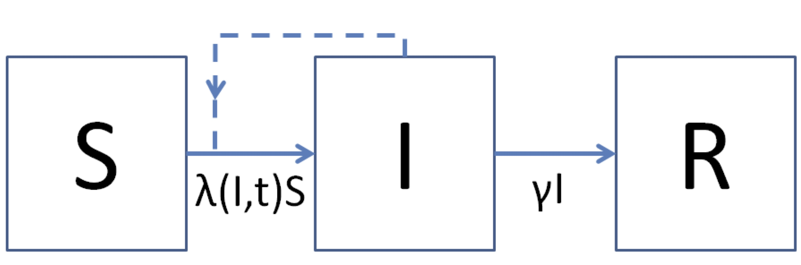
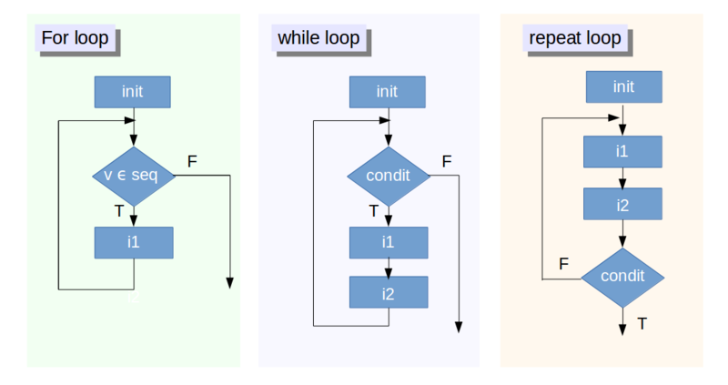
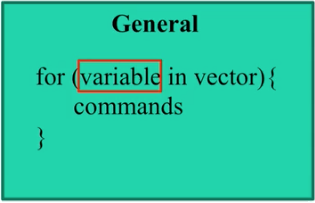

Simulating infectious diseases with R
========================================================
author: [NAME]
date: 
autosize: true
font-import: https://fonts.googleapis.com/css?family=PT+Sans
font-family: 'PT Sans', sans-serif;

***
<div class="midcenter"><div style="margin-left:-0px;margin-top:500px;"></img></div></div>


About Myself
========================================================

 - My research interest is [INSERT DESCRIPTION]
 - I use `R` in my research to:
   + organize data 
   + develop machine learning algorithms
   + 
 - I mostly work [in this disease system or approach] 
 - My contact info is [INSERT EMAIL]
 
Review of past workshops 
========================================================
**You should be able to...**

- code using best practices
- create an HTML doc with code and commentary  
- write a function
- calculate summary statistics of a dataset
- create a figure from data

Outline 
========================================================
left: 40%

**You should be able to...**
- iterate a calculation
- simulate populations based on an ODE

*** 

**Topics**
  1. Modeling Concepts
  2. Review of functions
  3. Converting ODEs to R code
  4. Simulate exponential growth of a population 
  
  *Break*
  
  5. Simulate an SIR model
  6. Iterations in `R`
  7. Wrap Up 


Introduction to ODE models 
========================================================
left: 50%
 

***

 


Terminology of ODE models 
========================================================
left: 50%
 <h1> $\frac{dN}{dt} = rN$ </h1>

***
What is (are) the

- independent variable?
- dependent variable?
- state variable?
- parameter(s)? 

Key points from the reading
========================================================

- What's the advantage of modeling infectious diseases?
- What are the different model types?
  -  continuous vs. discrete time
  -  stochastic vs. deterministic
- How would you categorize the SIR model presented?
- What is $R_0$ and how is it used? 
- What does it mean to *solve* an ODE? how is it done?


2. Anatomy of a function 
========================================================


```r
FunctionName <- function(arguement1, arguement2, ...){
  #some analysis
  return(outputOfFunction)
}
```

Example of a function
========================================================
 

```r
 PrevByParType <- function(dataset){
  dataset %>%
    drop_na(Prevalence) %>%
    group_by(Group) %>%
    summarise(MeanPrev = mean(Prevalence), SdErrPrev = sd(Prevalence)/sqrt(n()))
 }

PrevByParType(gmp)
```

3. Connecting concepts to code
========================================================
left: 50%

Based on the reading we know that ordinary differential equations (ODE) can be solved numerically by calculating the state variable at some time in the future. If the state is changing quickly, then the step size needs to be smaller to retain accuaracy. 

**This is called the Euler method.**

***

 


Euler method in R
========================================================
left: 50%

ODEs can be solved in `R` using the `lsoda` function in the `deSolve` package. 

The `lsoda()` functions has specific format requirements. 

Open the W3.Rproj to start today's exercise.  

***

 

Step 1. Install and load deSolve package
========================================================


```r
# install package (if not already)
install.packages("deSolve")

# load library
library(deSolve)
```

Step 2. Pull up lsoda manual page
========================================================

Use the `?` search function 

 

lsoda arguements
========================================================


Take a few minutes to decide what do the first 4 arguements mean

- y 
- times
- func
- params

lsoda arguements
========================================================

What do the first 4 arguements mean?

- y : Starting values for the state variable(s) 
- times : times that you want the state variable(s) recorded
- func : function describing how the state variable changes (Model)
- params : parameter values used in the model 

What are the special instructions for the func arguement?


func for lsoda
========================================================
The manual states that the function should be defined as: 


```r
func <- function(t,y,parms)
```

Let's work to write the exponential growth model $\frac{dN}{dt}= rN$ in this form 


switch over to `W3_Exercise.Rmd` to run model and plot solution.

========================================================
<h1>Break</h1>

Simulating an SIR model 
========================================================

work in groups of 2-3 to build an SIR model and simulate data

Steps:

1. Using ExponentialGrowth as a guide write a `DensityDepSIR()`
2. Run a simulation using the parameter values (beta, gamma) and initial state conditions (S=,I=,R=)
3. Plot the simulation


If your group finishes move onto exploring parameter values. 

Challenge: Parameter values of an SIR
========================================================

Once you have a working SIR model, simulate outbreaks with different parameter values. 

Explore the impact of the $\beta$ and $\gamma$ values on the size and duration of the outbreak. 

- What happens when $\gamma$ is increased? 
- What happens when $\beta$ is increased? 
- What happens when the ratio of is held constant but the absolute values change?

Are the changes what you expected? How would changing $\gamma$ or $\beta$ impact $R_0$?

Lessons learned: Simulating an SIR model 
========================================================

- `lsoda()` solves ODEs
- entries within a vector can be named (`c(N=10)`)
- state values can be modeled as proportion of total population
- `ggplot()` expects data as a data.frame class object
- Tidyverse pipes (`%>%`) can be fed into `ggplot()`
- `gather()` converts wide data to long format
- ...


Iterating in R
========================================================
left: 50%

- The Euler method is an example of iteration or repeating a process over and over. 
- Iteration can be a common part of data analysis and is implimented in `R` using loops

***

   


Loops come in a few different flavors
========================================================
   

We will focus on a For loop


Exponential Model
========================================================

The next time step if an exponentially growing population is:

$N_{t+1} = N_t + rN_t$

where

* $N_{t}$ is the current population size ($N_t = 10$) 
* $r$ is the per captia growth rate (2% , $~r=0.02$)


Exponential Model at t+1
========================================================


```r
Nt <- 10 # starting population
r <- 0.02 # population increases 2% each time
Nt1 <- Nt + r*Nt

Nt1
```

```
[1] 10.2
```

Let's iterate this function to determine the population size 100 time steps in the future. The means we have to repeat this 100 times- For loops automate this!

Exponential Model at t+100
========================================================
left: 50%

For loop syntax is: 

   

***

which is coded as: 


```r
for(i in 1:10){
  print(i)
}
```

What is the output of this loop? 


Exponential Model at t+100
========================================================
left: 50%

For loop syntax is: 

   

***

which is coded as: 


```r
for(i in 1:10){
  print(i)
}
```

```
[1] 1
[1] 2
[1] 3
[1] 4
[1] 5
[1] 6
[1] 7
[1] 8
[1] 9
[1] 10
```


Exponential Model at t to t+100
========================================================

Starting with a vector `N.seq` where `N.seq[1]`$=N_t$ use the `N.seq[i]` and `N.seq[i+1]` to finish this loop.


```r
N.seq <- c(rep(0,100)) # make a vector where the calculations will be stored. 
N.seq[1] <- 10 # set the current population size to 10 

for(i in 1:100){
    # command to iterate N_t+1 calculation
}

N.seq # N at N_t through N_t+100 
```

Exponential Model at t to t+100
========================================================

Here we are using the value at $N_t$ (`N.seq[i]`) to calculate the value at the next time step $N_{t+1}$ which is saved in the next spot of the `N.seq` vectors at `N.seq[i+1]`


```r
N.seq <- c(rep(0,100)) # make a vector where the calculations will be stored. 
N.seq[1] <- 10 # set the current population size to 10 

for(i in 1:100){
    N.seq[i+1] <- N.seq[i] + (r*N.seq[i])
}

N.seq # vector of N at N_t through N_t+100 
```

*Concept check: what would N.seq look like if the for command was changed to for(i in 1:50)?*


8. Wrap Up 
========================================================
**You should be able to...**

- iterate a calculation
- simulate populations based on an ODE
- <span style="color:gray"> write a function </span>
- <span style="color:gray"> create an HTML doc with code and commentary  </span>
- <span style="color:gray"> write code following best practices </span>
- <span style="color:gray"> calculate summary statistics of a dataset </span>
- <span style="color:gray"> create a figure from data </span>

 
========================================================
left: 40%
left: 50%
    
**Next**

  - Data visualization
  - Statistical analysis
  
***


