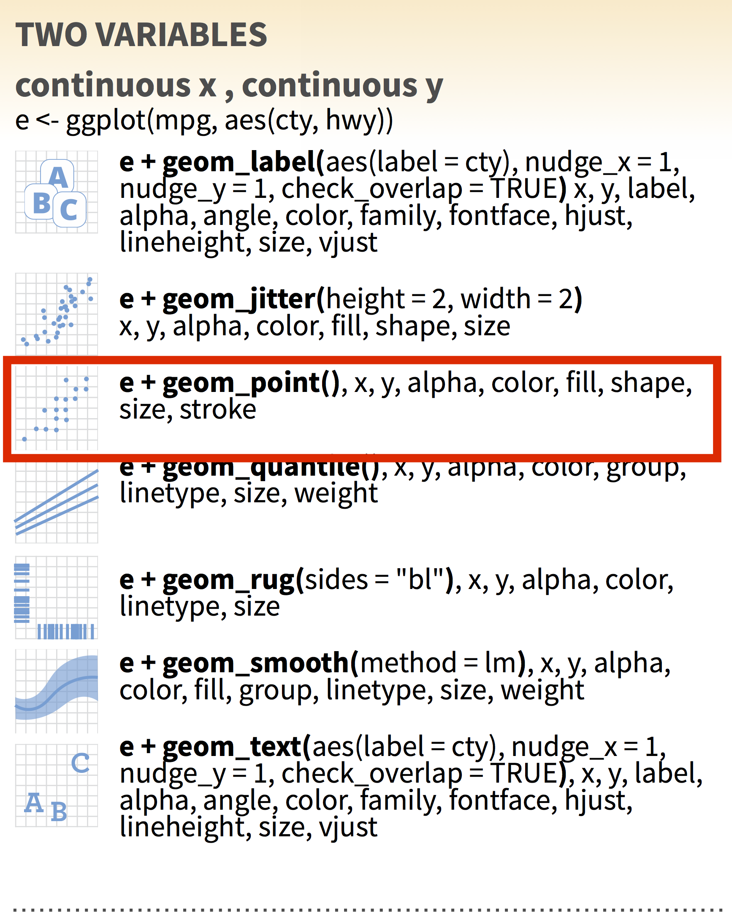

Data Visualization in R
========================================================
author: Robbie Richards
date: 
autosize: true
font-import: https://fonts.googleapis.com/css?family=PT+Sans
font-family: 'PT Sans', sans-serif;

***

</img>

About Myself
========================================================

 - My research interest is predator-parasite interactions.
 - I use `R` in my research to:
   + analyze data from the field and lab
   + map out hotspots of disease risk
   + predict species distributions
   + help "future-me" remember what I did
 - I mostly work with small mammals, their predators, and their gastro-intestinal parasites
 - My contact info is robert.richards@uga.edu
 
Review of past workshops 
========================================================
left: 60%

**You should be able to...**

- iterate a calculation
- simulate populations
- write a function
- create an HTML doc with code and commentary  
- write code following best practices
- calculate summary statistics of a dataset
- create a figure from data 

***

Outline 
========================================================
left: 40%

**You should be able to...**
- customize figures
- code a t-test 
- code a correlation
- code a linear regression

*** 

**Topics**
  1. Approach to visualizations
  2. `ggplot` review
  3. Plotting challenge 
  
    *Break*
    
  4. Inferential statistics
  5. Wrap Up 
 
 
 1. Approach to visualization
========================================================

Visualizations are useful for **data exploration** and **presentation**. 

Characteristics of data exploration visualizations 
  * complex
  * minimally annotated
  * potentially pattern-less 

should be avoided for presentation visualizations. 

Presentation visualizations
========================================================
 should guide the reader through the research.
 

Presentation visualizations
========================================================

We've spent a bit of time making figures for exploration, but haven't touched on presentation quality visualizations. 

**What are some characteristics of a good presentation visualization?**

2. Review of ggplot
========================================================  
 plots are divided into 3 fundamental parts
 
 **plot = data + Aesthetics + geometry**
 
 

Minimium arguements  
========================================================  

***

Using the ggplot2 cheat sheet
========================================================  

The cheat sheet reads like a choose your adventure book. 

***
1. Based on your data, go to the One, Two or Three variables section. 

Using the ggplot2 cheat sheet
========================================================  

The cheat sheet reads like a choose your adventure book. 

***
1. Based on your data, go to the One, Two or Three variables section. 
2. If Two Variables decided if x and y are continuous. 

Using the ggplot2 cheat sheet
========================================================  

The cheat sheet reads like a choose your adventure book. 

***
1. Based on your data, go to the One, Two or Three variables section. 
2. If Two Variables decided if x and y are continuous. 
2. Start you ggplot based on the example given under the heading 

Using the ggplot2 cheat sheet
========================================================  

The cheat sheet reads like a choose your adventure book. 

***
1. Based on your data, go to the One, Two or Three variables section. 
2. If Two Variables decided if x and y are continuous. 
2. Start you ggplot based on the example given under the heading 
4. Add `geom_function` and additional aesthetic mapping as needed 

Using the ggplot2 cheat sheet
========================================================  

The cheat sheet reads like a choose your adventure book. 

***
1. Based on your data, go to the One, Two or Three variables section. 
2. If Two Variables decided if x and y are continuous. 
2. Start you ggplot based on the example given under the heading 
4. Add `geom_function` and additional aesthetic mapping as needed 
5. Repeat last step until finished. 

3. Plotting challenge
========================================================  
Often, you'll have an idea of the visualization you'd like to make. 

**But how to get there?**

***

practice (*and google*) 

3. Plotting challenge
========================================================  

For the visualization exercises you'll work with the people sitting in your row. 

* Open `W4_Exercise\DataViz_X.html` with the number corresponding to your row.
* Complete the 2 challenges as a group. (*this is a chance to practice starting a new project*)
    + Every group has the same 1$^{st}$ challenge, but different 2$^{nd}$ challenge
    + When you're finished, practice explaining your Challenge 2 code.
* We'll shuffle groups and explain the solutions to eachother. 

If you finish early, add more details to the plots or try exporting as a .png. 

3. Plotting challenge
========================================================  

**What were some of the interesting things you learned?**

========================================================  

 <h1> *Break* </h1>
  
When you come back we'll be switching gears to inferential statistics

4. Inferential statistics
========================================================  

is the branch of statistics that deals with hypothesis tests.

`R` **is much better for inferential statistics than other software** 

*why?*

Strength of R for statistics
========================================================  
`R` **is much better for inferential statistics than other software** 

* many of the common statistical analyses already exist as part of libraries
* code based analysis means modifications to analysis are recorded
* ...

We want to to ask:
========================================================  
left: 65%
 

**Question**

You are tasked with *determining if butterfly infection prevalence is related to the region in which the butterflies were sampled and whether there are significant relationships with urbanization metrics*. There are many approaches that you could take, but start with the basic inferential statistics to ask:
  
  1. Is the average monarch infection prevalence different between regions?
  2. Is the prevalence associated with urbanization metrics? 
  3. Are any of the urbanization metrics correlated with each other?
  
***
 

**Test**

1. T-tests `t.test()`
2. Linear regressions `lm()`
3. Correlation `cor.test()`

Start by opening `W4_Exercise\W4_Exercise.Rproj` 

We want to compare regions to ask:
========================================================  
left: 50%
 
**Test**

1. T-tests `t.test()`
2. Linear regressions `lm()`
3. Correlation `cor.test()`

***
 
**Result**

1. the means differ 

We want to compare regions to ask:
========================================================  
left: 50%
 
**Test**

1. T-tests `t.test()`
2. Linear regressions `lm()`
3. Correlation `cor.test()`

***
 
**Result**

1. the means differ
2. some are strongly, positively correlated

We want to compare regions to ask:
========================================================  
left: 50%
 
**Test**

1. T-tests `t.test()`
2. Linear regressions `lm()`
3. Correlation `cor.test()`

***
 
**Result**

1. the means differ
2. relationships between infection and urbanization
3. some are strongly, positively correlated

5. Wrap Up: We can ...
========================================================
left: 65%

- calculate summary statistics of a dataset
- create a figure from data 
- create an HTML doc with code and commentary  
- write code following best practices
- write a function
- iterate a calculation
- simulate populations
- customize figures
- code basic inferential statistics

***

